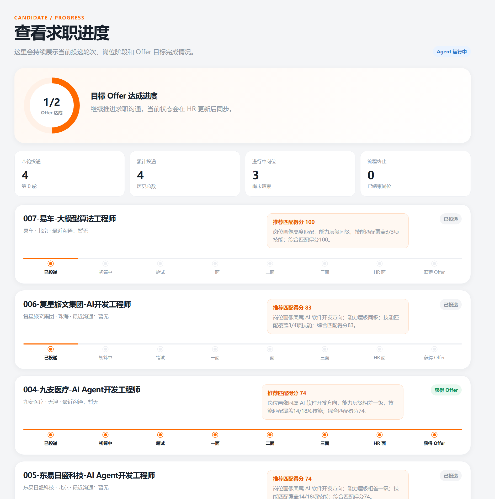
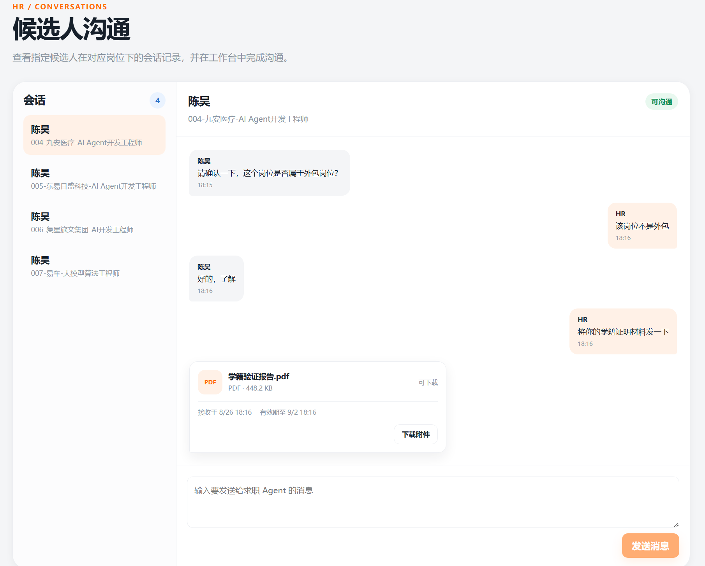
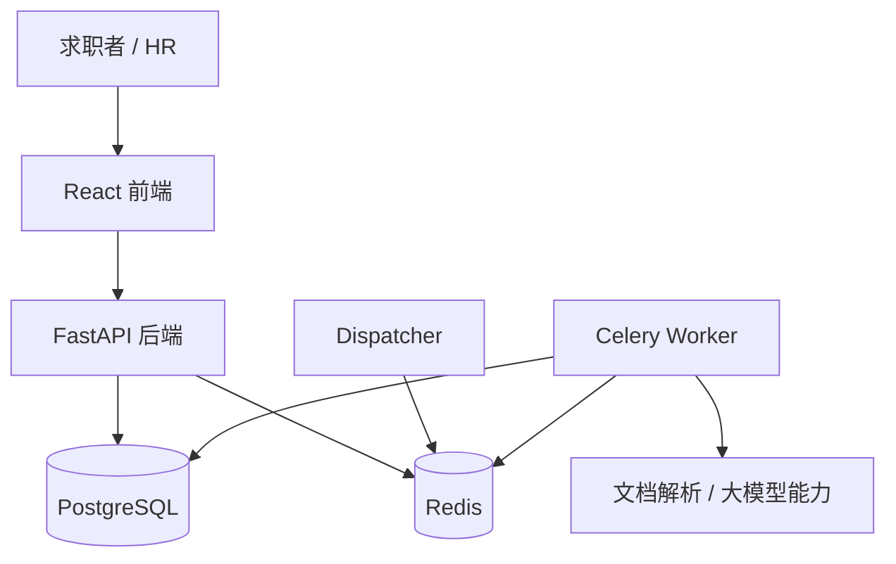

# Careerpass

> 面向求职者和 HR 的 AI 求职协作平台，通过简历解析、岗位匹配、系统内沟通和投递进度管理，构建完整、可追踪的智能求职闭环。

**在线体验：** [Careerpass 正式系统](http://8.133.216.96/) · [HTML 原型在线演示](https://mingyuexinc.github.io/Careerpass/)

## 项目介绍

求职过程中，简历、岗位 JD、求职目标、投递状态和沟通记录通常分散在不同工具中，求职者和 HR 很难围绕同一份业务上下文协作。Careerpass 将这些环节组织到同一个双角色工作区中，让求职者、HR 和求职 Agent 围绕岗位与投递记录完成可观察的业务闭环。

项目围绕一条完整的业务流程展开：HR 提供岗位 JD，求职者提交简历并设置求职目标，Agent 根据结构化资料完成岗位筛选和系统内投递，HR 继续推进招聘阶段并与 Agent 沟通，Offer 达到目标后 Agent 自动结束。



*求职者投递进度与 Offer 目标管理*

## 项目价值

- **目标驱动的求职 Agent。** 用户只需要设定求职目标，Agent 会结合简历、求职偏好和当前投递进度，判断下一步的行动方向，执行岗位匹配、投递或求职沟通等任务。相比传统的问答式助手，该项目更强调 Agent 根据当前状态自主判断并推进任务，无需用户每一步手动操作。
- **更精准的岗位匹配。** 系统会先对简历和 JD 做结构化解析，再结合地点、薪资等硬条件过滤，以及语义召回、多维度匹配评分和重排序，从候选岗位中筛选出更适合当前求职目标的结果。同时保留技能、经验、岗位方向等匹配依据，方便用户理解为什么推荐这个岗位。
- **闭环的求职流程管理。** 系统围绕“岗位匹配 → 求职沟通 → 结果推进”构建完整业务链路，并重点针对结果推进补充了相应的工具能力，包括业务资料上传、岗位信息补充和招聘阶段更新等。Agent 基于当前岗位、候选人资料和沟通状态持续推进目标任务，打通各个业务环节实现闭环。

## 功能和特性

核心业务流程如下：

```text
HR 上传岗位 JD
    → 求职者上传简历并创建求职目标
    → 启动求职 Agent
    → 岗位匹配与系统内投递
    → HR 沟通并更新投递进度
    → Offer 达标后 Agent 结束
```

求职者侧支持：

- 角色登录和求职者工作区；
- 简历上传及解析状态展示；
- 其他求职资料上传；
- 求职目标创建和启动条件展示；
- 启动求职 Agent；
- 查看投递岗位、匹配得分、推荐理由和招聘阶段；
- 查看 Offer 目标和 Agent 运行状态。

HR 侧支持：

- 角色登录和 HR 工作区；
- 岗位 JD 上传及逐文件结果展示；
- 查看岗位下的候选人投递；
- 查看系统内沟通记录并向 Agent 发送消息；
- 更新投递记录的招聘阶段；
- 观察投递进度和 Agent 状态的联动变化。



*HR 在岗位上下文中与求职 Agent 沟通并获取候选人资料*

系统特性包括：

- 简历和岗位 JD 的结构化解析；
- 求职目标驱动的 Agent 启动条件；
- 匹配结果与投递记录独立持久化；
- 投递状态机和合法状态迁移；
- 文件上传、删除和重复请求的幂等处理；
- 角色权限、资源归属和沟通上下文校验；
- Agent 达成 Offer 目标后的自动结束。

产品当前聚焦系统内招聘协作，真实招聘平台连接、实时消息推送和多轮投递等能力可在现有业务模型和技术架构上继续扩展。

## 技术选型、方案设计与架构设计

| 层级 | 技术 |
| --- | --- |
| 前端 | TypeScript、React 19、Vite、React Router、Zustand |
| 后端 | Python 3.12、FastAPI、Pydantic、SQLAlchemy、Alembic |
| 数据与任务 | PostgreSQL、Redis、Celery、Dispatcher |
| AI 与文档能力 | MinerU、Qwen、结构化输出校验 |
| 测试与质量 | Vitest、Testing Library、Pytest、Ruff |
| 部署 | Docker Compose、Caddy |

整体架构如下：



关键方案包括：

- **前端数据访问隔离：** 页面通过业务组件、Hook 和 Repository 访问后端 HTTP API，避免页面直接依赖数据实现，保持页面流程与数据源解耦。
- **Agent 输出治理：** 模型输出必须经过结构化校验、业务规则校验和授权范围校验，不能直接作为事实写入数据库或驱动外部副作用。
- **异步任务可追踪：** 文档解析等任务记录处理状态、失败原因和重试信息，并通过 Worker 与 Dispatcher 支撑可重试、幂等的任务执行。
- **权限和归属校验：** 简历、岗位、投递、会话和消息均按当前角色与业务关系校验访问范围，不能仅凭资源 ID 操作。
- **状态机管理流程：** 投递状态只能按照合法阶段推进，Offer 和流程终止属于终态，Agent 生命周期与 Offer 目标保持联动。
