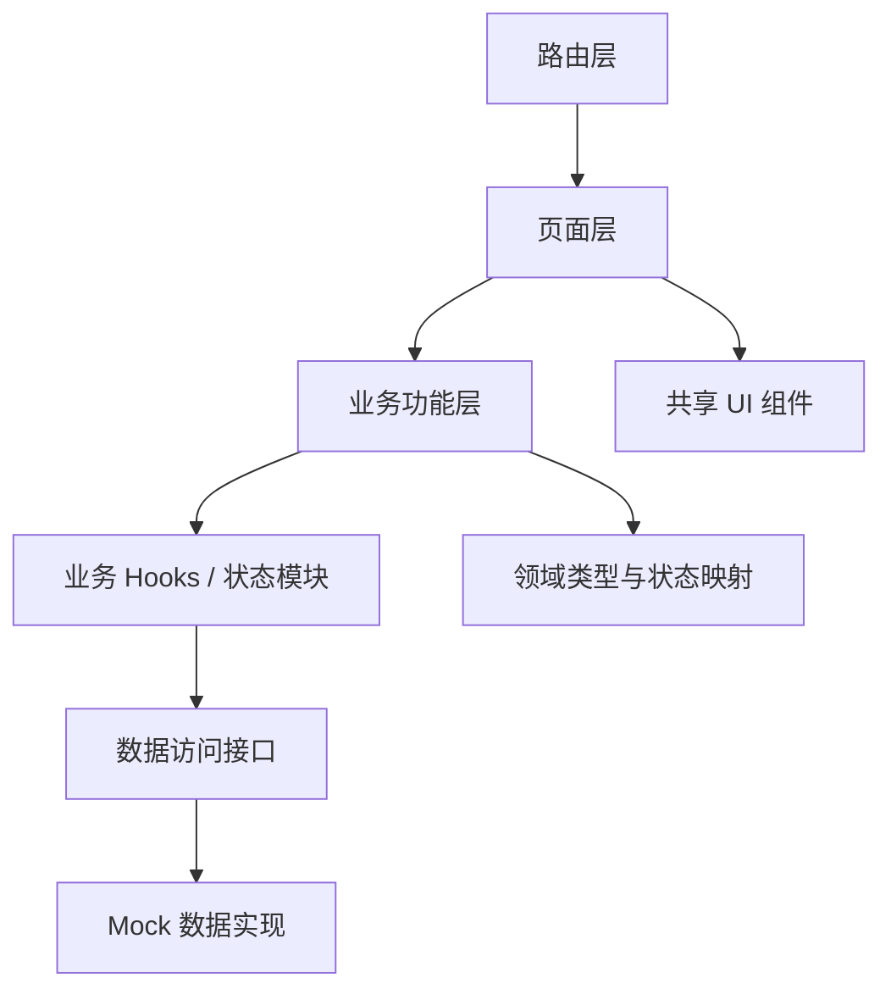
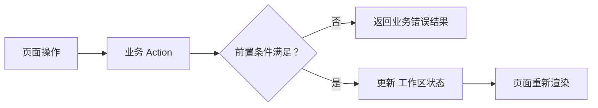
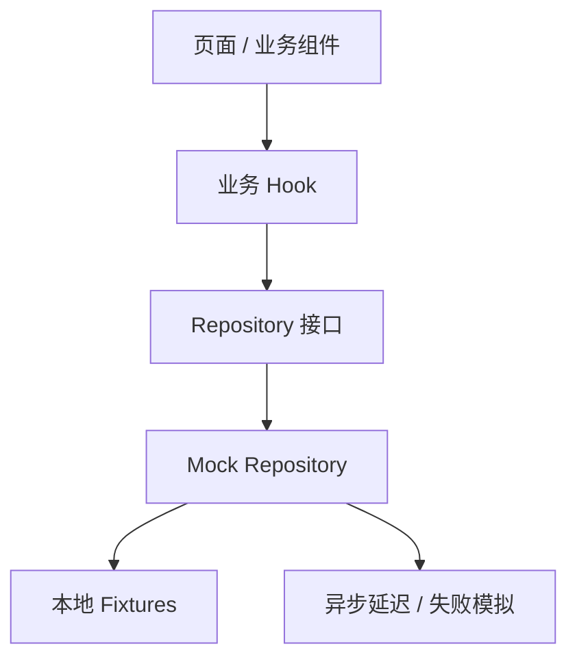
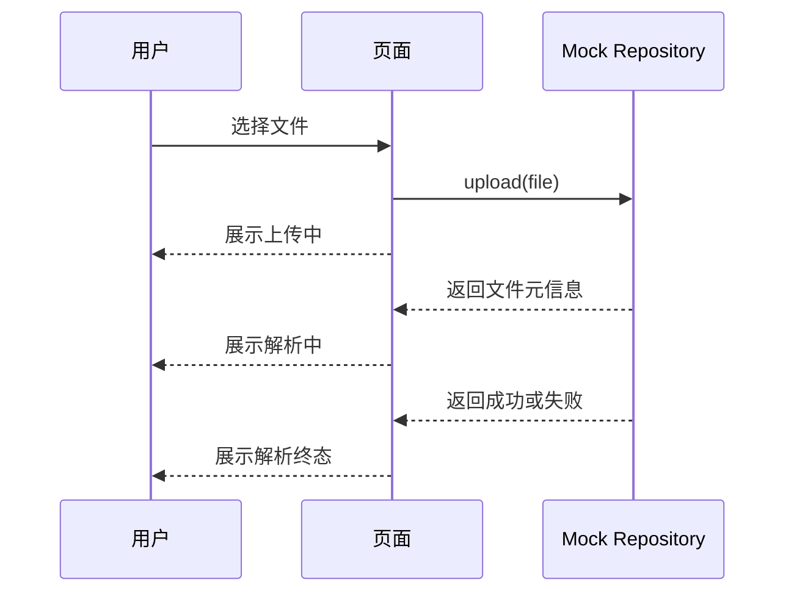

# Careerpass 前端技术架构

> 版本：v0.1
>
> 状态：前端 MVP 技术方案
>
> 技术栈前提：TypeScript + React

## 1. 文档定位

本文档定义 Careerpass 正式前端 MVP 的技术选型、工程结构、页面组织、状态管理、Mock 数据访问和后续演进方式。

本文档依据：

- `docs/decisions/frontend-development-decisions.md`
- `docs/product/frontend-acceptance-flow.md`
- `docs/product/frontend-product-flow.md`
- `docs/development/local-data-spec.md`

当前版本架构默认支持前端独立开发和 Mock 验收；从 S-06 开始，按已锁定的 Integration Contract 为具体页面接入真实后端，其他尚未进入联调的页面仍不提前实现真实后端能力。

## 2. 架构目标

| 目标 | 架构要求 |
| --- | --- |
| 原型迁移 | 可以复用原型验证过的页面形态和交互流程 |
| 前端闭环 | 支持求职者和 HR 两种角色的完整业务流程 |
| 数据解耦 | 页面不直接依赖固定 Mock 文件或未来后端接口 |
| 状态清晰 | 统一管理简历、Agent、投递和沟通状态 |
| 适度简单 | 只引入支撑 MVP 所需的技术和依赖 |
| 可替换 | Mock 数据访问层可以替换为真实 API 适配层 |
| 可维护 | 页面、业务组件、状态和数据访问边界清晰 |

## 3. 技术选型

### 3.1 核心技术栈

| 层级 | 选型 | 选择理由 |
| --- | --- | --- |
| 编程语言 | TypeScript | 为领域对象、页面状态和数据访问提供静态类型约束 |
| UI 框架 | React | 适合组件化页面和复杂交互状态，生态成熟 |
| 构建工具 | Vite | 配置简单、开发启动快，适合当前前端 MVP |
| 路由 | React Router | 支持公共页面、角色页面和受保护路由 |
| 全局状态 | Zustand | API 简单，适合管理当前用户、工作区会话和跨页面业务状态 |
| 样式方案 | CSS Modules + 全局 CSS 变量 | 兼顾组件样式隔离和设计变量统一管理 |
| 测试运行器 | Vitest | 与 Vite 配合紧密，启动快，适合单元测试 |
| 组件测试 | Testing Library | 从用户行为角度验证页面和组件 |
| 代码检查 | ESLint + Prettier | 统一代码质量和格式 |

### 3.2 暂不引入的技术

| 技术 | 当前处理 |
| --- | --- |
| 服务端状态缓存库 | 当前版本 Mock 数据规模小，先由业务 Hook 和数据访问层管理；接入真实 API 后再评估 TanStack Query |
| Redux | 当前 MVP 状态规模不足以支持其复杂度，暂不引入 |
| UI 组件库 | 优先根据原型建立项目自己的基础组件，避免引入不必要的视觉约束 |
| WebSocket、SSE | 当前版本不实现实时推送，使用 Mock 延迟和手动刷新表达状态变化 |
| 真实认证 SDK | 使用固定 角色身份，后续通过认证适配层接入真实认证 |
| 复杂表单框架 | 当前表单数量有限，先使用 React 状态和受控组件 |

## 4. 总体架构

### 4.1 分层结构



### 4.2 各层职责

| 层级 | 目录示例 | 职责 | 禁止事项 |
| --- | --- | --- | --- |
| 路由层 | `app/`、`routes/` | 注册路由、角色访问和页面布局 | 不承载业务数据处理 |
| 页面层 | `pages/` | 组合页面结构和业务模块 | 不直接写 Mock 数据 |
| 业务功能层 | `features/` | 组织某一业务域的组件、Hook 和数据行为 | 不跨业务域复制状态逻辑 |
| 共享 UI 层 | `components/` | 提供通用展示和交互组件 | 不包含具体岗位或求职业务规则 |
| 状态层 | `stores/`、业务 Hook | 管理跨页面状态和异步操作状态 | 不让页面直接修改底层数据 |
| 数据访问层 | `api/`、`repositories/` | 定义数据访问接口和 Mock 实现 | 不把数据请求散落到组件中 |
| 领域层 | `domain/`、`types/` | 定义实体、状态值、显示映射和迁移规则 | 不在页面中重复定义状态 |
| 样式层 | `styles/`、组件样式 | 管理设计变量和组件局部样式 | 不在页面中大量堆积全局样式 |

## 5. 项目目录设计

```text
careerpass-frontend/
├── AGENTS.md
├── README.md
├── package.json
├── tsconfig.json
├── vite.config.ts
├── public/
├── docs/
├── prototypes/
└── src/
    ├── main.tsx
    ├── app/
    │   ├── App.tsx
    │   ├── router.tsx
    │   └── providers.tsx
    ├── layouts/
    │   ├── AppShell.tsx
    │   ├── AuthLayout.tsx
    │   └── RoleLayout.tsx
    ├── pages/
    │   ├── auth/
    │   ├── candidate/
    │   └── hr/
    ├── features/
    │   ├── auth/
    │   ├── resumes/
    │   ├── job-goals/
    │   ├── applications/
    │   ├── conversations/
    │   └── jobs/
    ├── components/
    │   ├── layout/
    │   ├── feedback/
    │   ├── form/
    │   └── data-display/
    ├── api/
    │   ├── contracts/
    │   ├── repositories/
    │   └── mock/
    ├── domain/
    │   ├── types.ts
    │   ├── statuses.ts
    │   └── mappings.ts
    ├── stores/
    │   ├── auth-store.ts
    │   └── workspace-store.ts
    ├── styles/
    │   ├── globals.css
    │   ├── tokens.css
    │   └── reset.css
    ├── lib/
    └── test/
```

### 5.1 目录使用规则

| 目录 | 使用规则 |
| --- | --- |
| `pages/` | 一个文件对应一个页面入口，负责页面组合 |
| `features/` | 按业务域组织可复用业务组件、Hook 和行为 |
| `components/` | 只放跨业务域可复用的通用组件 |
| `api/repositories/` | 定义数据访问接口，不直接暴露 Mock 数据结构 |
| `api/mock/` | 实现本地数据访问和模拟异步行为 |
| `domain/` | 集中维护领域类型、状态值和显示文案 |
| `stores/` | 只保存跨页面共享状态，不替代所有局部组件状态 |
| `prototypes/` | 原型参考资源，正式 `src/` 不直接依赖其运行代码 |

## 6. 路由设计

### 6.1 路由原则

- 路由使用语义化路径，不把页面实现细节暴露在路径中。
- 未登录用户不能访问角色业务路由。
- 求职者和 HR 使用独立的角色路由区域。
- 页面访问控制用于当前前端权限展示，未来真实权限仍由后端校验。
- 路由配置集中维护，不在页面组件中自行判断路径。

### 6.2 路由表

| 路径 | 页面 | 角色 | 访问条件 |
| --- | --- | --- | --- |
| `/login` | 登录页 | 公共 | 无 |
| `/register` | 注册页 | 公共 | 无，非主流程 |
| `/candidate` | 求职者欢迎页 | 求职者 | 已登录且角色为求职者 |
| `/candidate/documents` | 求职资料上传页 | 求职者 | 已登录且角色为求职者 |
| `/candidate/job-goal` | 求职任务配置页 | 求职者 | 已登录且角色为求职者 |
| `/candidate/progress` | 求职进度看板 | 求职者 | 已登录且角色为求职者 |
| `/hr` | HR 欢迎页 | HR | 已登录且角色为 HR |
| `/hr/jobs` | 岗位上传页 | HR | 已登录且角色为 HR |
| `/hr/conversations` | 求职沟通页 | HR | 已登录且角色为 HR |
| `/hr/applications` | 投递进度管理页 | HR | 已登录且角色为 HR |
| `*` | 未找到页 | 公共 | 无 |

### 6.3 布局关系

```text
App
├── AuthLayout
│   ├── LoginPage
│   └── RegisterPage
└── RoleLayout
    ├── CandidateLayout
    │   ├── CandidateHomePage
    │   ├── DocumentsPage
    │   ├── JobGoalPage
    │   └── ProgressPage
    └── HrLayout
        ├── HrHomePage
        ├── JobsPage
        ├── ConversationsPage
        └── ApplicationsPage
```

## 7. 状态管理

### 7.1 状态分类

| 状态类型 | 示例 | 管理位置 |
| --- | --- | --- |
| 页面局部状态 | 输入框内容、弹窗开关、当前选中岗位 | 页面或业务组件内部 |
| 表单状态 | 求职目标输入、消息草稿、文件选择 | 对应业务 Hook 或页面 |
| 当前用户状态 | 当前角色、登录状态、显示名称 | `auth-store` |
| 工作区业务状态 | 简历、目标、投递记录、会话和消息 | `workspace-store` 或业务状态模块 |
| 异步操作状态 | 上传中、解析中、发送中、失败 | 对应业务 Hook |
| 只读映射 | 状态文案、状态颜色、阶段顺序 | `domain/mappings.ts` |

### 7.2 Zustand 使用边界

Zustand 只用于跨页面共享的当前用户和 工作区业务状态，不把所有组件状态集中到一个全局 Store。

```text
auth-store
├── currentUser
├── login()
└── logout()

workspace-store
├── resume
├── jobGoal
├── jobs
├── applications
├── conversations
├── startAgent()
├── updateApplicationStatus()
└── resetData()
```

业务操作应通过明确的方法改变状态，页面不得直接修改数组、对象或嵌套字段。

### 7.3 状态迁移

状态迁移集中定义，页面只触发操作并展示结果：



核心迁移包括：

| 操作 | 前置条件 | 状态结果 |
| --- | --- | --- |
| 上传简历 | 选择了文件且当前允许替换 | 简历进入上传中或解析中 |
| 完成解析 | 简历处于解析中 | 简历进入成功或失败 |
| 创建求职目标 | 用户已登录且表单数据有效 | 当前目标创建或更新；不绑定简历 |
| 启动 Agent | 目标存在、当前简历解析成功且画像、岗位条件满足 | S-07 绑定当前简历，Agent 进入运行中 |
| 修改投递状态 | 投递记录存在且目标状态合法 | 当前投递记录状态更新 |
| 发送消息 | 会话存在且输入非空 | 消息追加，Agent 回复中 |
| Offer 达标 | Offer 数量达到目标 | Agent 进入已结束 |

## 8. Mock 数据架构

### 8.1 访问结构



### 8.2 Repository 接口

Repository 只定义页面需要的业务操作，不暴露底层 Fixture 的组织方式。

```ts
interface ResumeRepository {
  getCurrent(): Promise<Resume | null>;
  upload(file: File): Promise<Resume>;
  setParseResult(result: "succeeded" | "failed"): Promise<Resume>;
}

interface ApplicationRepository {
  list(): Promise<Application[]>;
  updateStatus(
    applicationId: string,
    status: DeliveryProgress,
  ): Promise<Application>;
}

interface ConversationRepository {
  list(): Promise<Conversation[]>;
  sendMessage(conversationId: string, content: string): Promise<Message[]>;
}
```

以上为架构示例，正式实现时以业务页面实际需要的最小接口为准。

### 8.3 Mock 行为

| 行为 | 规则 |
| --- | --- |
| 成功请求 | 返回固定数据的副本，避免页面直接修改原始 Fixture |
| 异步延迟 | 上传、解析、消息回复等操作模拟短暂延迟 |
| 失败场景 | 可切换解析失败、上传失败、消息失败和列表加载失败 |
| 重复提交 | 操作进行中拒绝重复执行 |
| 数据重置 | `resetData()` 恢复所有 Fixture 的初始快照 |
| 数据隔离 | 求职者和 HR 的页面通过角色状态读取不同视图 |

### 8.4 Fixture 组织

正式前端的 Fixture 建议按业务域组织：

```text
src/api/mock/fixtures/
├── users.ts
├── resumes.ts
├── jobs.ts
├── job-goals.ts
├── applications.ts
├── conversations.ts
└── scenarios.ts
```

`prototypes/reference-data/first-round-matching-jobs.js` 仅作为原型参考数据，不由正式页面直接导入。

## 9. 领域类型和状态映射

### 9.1 类型集中管理

核心类型集中放置在 `src/domain/` 或业务域内部的 `types.ts`，页面不得重复声明同一领域对象。

```ts
type UserRole = "candidate" | "hr";

type ResumeParseStatus =
  | "not_uploaded"
  | "uploading"
  | "processing"
  | "succeeded"
  | "failed";

type AgentStatus = "not_started" | "ready" | "running" | "finished";

type DeliveryProgress =
  | "submitted"
  | "screening"
  | "written_test"
  | "interview_1"
  | "interview_2"
  | "interview_3"
  | "hr_interview"
  | "offer"
  | "terminated";
```

### 9.2 状态映射

状态值、中文文案、颜色和是否终态统一维护：

```ts
const deliveryProgressMeta: Record<DeliveryProgress, {
  label: string;
  isTerminal: boolean;
}> = {
  submitted: { label: "已投递", isTerminal: false },
  screening: { label: "初筛中", isTerminal: false },
  written_test: { label: "笔试", isTerminal: false },
  interview_1: { label: "一面", isTerminal: false },
  interview_2: { label: "二面", isTerminal: false },
  interview_3: { label: "三面", isTerminal: false },
  hr_interview: { label: "HR 面", isTerminal: false },
  offer: { label: "获得 Offer", isTerminal: true },
  terminated: { label: "流程终止", isTerminal: true },
};
```

## 10. 文件上传和异步状态

当前版本文件上传只模拟前端操作，不保存真实文件内容。



约束：

- 文件输入控件只负责选择文件。
- 上传和解析状态由业务层管理。
- 页面不读取或展示真实简历原文。
- Agent 运行中或已结束时，当前轮次的简历替换操作不可用。
- 失败状态必须提供重新上传或重试路径。

## 11. 错误和反馈处理

### 11.1 前端错误类型

| 类型 | 示例 | 页面处理 |
| --- | --- | --- |
| 表单错误 | 目标 Offer 数量为空 | 在字段附近展示校验提示 |
| 前置条件错误 | 简历未解析成功 | 禁用启动按钮并展示原因 |
| 操作失败 | 上传失败、消息发送失败 | 展示失败反馈并允许重试 |
| 空数据 | 没有投递记录、没有会话 | 展示业务空状态 |
| 访问错误 | 角色不匹配、页面不存在 | 跳转或展示统一错误页面 |
| 未知错误 | 未分类的 Mock 异常 | 展示通用失败反馈，不展示内部细节 |

### 11.2 统一反馈要求

- 业务组件不直接弹出不可控的原生错误信息。
- 错误反馈使用用户可理解的固定文案。
- 错误状态不泄露内部路径、Fixture 结构或调试堆栈。
- 异步操作期间保持按钮和输入控件状态明确。
- 失败后保留用户仍可继续操作所需的上下文。

## 12. 测试架构

### 12.1 测试层级

| 层级 | 测试内容 |
| --- | --- |
| 类型检查 | TypeScript 编译和类型约束 |
| 单元测试 | 状态映射、状态迁移、数据访问和格式化函数 |
| 组件测试 | 上传卡片、进度条、消息列表、条件清单等 |
| 页面测试 | 登录、资料、任务、进度、沟通和投递页面 |
| 流程测试 | 从登录到 Agent 结束的完整业务路径 |
| 构建测试 | 生产构建成功，路由和静态资源可加载 |

### 12.2 优先测试流程

```text
登录角色切换
→ 简历上传和解析状态
→ 求职目标创建和启动条件
→ Agent 启动
→ 投递记录为空和有记录
→ HR 修改投递状态
→ HR 发送消息和 Agent 回复
→ Offer 达标后 Agent 结束
→ 数据恢复
```

## 13. 配置和环境

### 13.1 环境

| 环境 | 数据源 | 用途 |
| --- | --- | --- |
| `development` | Mock | 日常开发和交互调试 |
| `test` | 测试 Fixture | 自动化测试 |
| `preview` | Mock 或独立验证配置 | 产品验收和原型对比 |
| `production` | 后续真实 API 适配层 | 当前版本暂不交付 |

### 13.2 配置原则

- Mock 开关通过环境配置或构建入口管理。
- 页面组件不读取环境变量来决定业务逻辑。
- 不在仓库中保存真实 Token、密码或外部服务凭证。
- 当前没有真实 API Base URL 依赖，后续接入时再增加统一配置。

## 14. 后续演进路线

### 阶段一：正式前端 MVP

- TypeScript + React + Vite 工程初始化。
- 完成路由、布局、页面、组件和 Mock 数据层。
- 完成求职者和 HR 主流程。

### 阶段二：真实数据接入

- 保留页面和领域类型。
- 将 Mock Repository 替换为 HTTP Repository。
- 增加统一请求、认证、错误和权限适配。
- 根据真实接口补充异步任务状态查询。

### 阶段三：能力扩展

- 多轮投递。
- 多个求职目标。
- 真实消息同步。
- 更完整的权限和会话管理。
- 真实 Agent 运行状态和任务追踪。

后续阶段不得为了预留扩展而提前引入通用平台、复杂状态框架或未使用的基础设施。

## 15. 架构验收标准

- [ ] 工程使用 TypeScript + React。
- [ ] 页面、业务组件、共享组件和数据访问层边界清晰。
- [ ] 路由覆盖公共、求职者和 HR 页面。
- [ ] 当前用户和 工作区业务状态可跨页面共享。
- [ ] 页面不直接读取或修改 Fixture。
- [ ] Mock 数据访问接口可以替换而不改变页面主要结构。
- [ ] 状态值和显示文案集中维护。
- [ ] 上传、解析、发送消息和投递状态更新具备异步状态。
- [ ] 支持空、失败、成功、加载和禁用场景。
- [ ] 项目可以执行类型检查、测试和生产构建。
