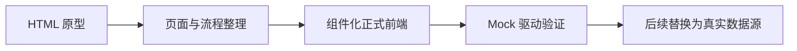
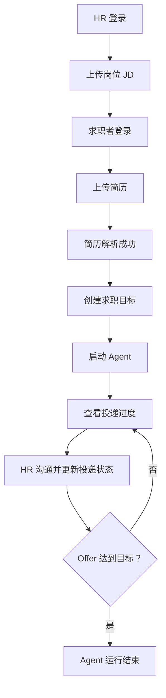

# Careerpass 前端开发决策

> 版本：v0.1
>
> 状态：前端 MVP 开发目标草案
>
> 依据：`docs/product/frontend-acceptance-flow.md`

跨前后端业务语义以项目级 [`docs/business/business-baseline.md`](../../../docs/business/business-baseline.md) 为共同基线；本文档只记录前端范围和前端工程决策。

## 1. 文档目的

本文档定义 Careerpass 前端项目当前阶段的开发目标、交付边界和基本开发决策，为页面规格、本地数据、前端架构和开发规范提供统一依据。

本版本只针对前端项目和可重复验收的 MVP，不以解决后端系统设计问题或交付生产级全链路为目标。

## 2. 项目定位

Careerpass 前端的当前目标是：将已有 HTML 原型转化为结构清晰、可维护、可重复验收、便于后续接入真实数据的正式前端 MVP。

正式前端需要保留原型已经验证的页面形态和主流程，但不直接把原型中的单文件结构、固定 DOM 和页面内 Mock 逻辑作为正式工程结构。



## 3. 当前版本开发目标

### 3.1 总目标

在不依赖当前后端文档和真实后端能力的前提下，完成一个能够稳定验证求职者侧和 HR 侧核心闭环的前端 MVP。

### 3.2 目标清单

| 目标 | 目标结果 |
| --- | --- |
| 原型迁移 | 将 HTML 原型中的页面、布局和主交互迁移为正式前端页面 |
| 页面闭环 | 完成登录、资料、任务、进度、岗位、沟通和投递进度页面 |
| 双角色体验 | 同一前端应用支持求职者和 HR 两种 用户角色 |
| 状态表达 | 清晰展示上传、解析、Agent、投递和沟通的状态变化 |
| 数据解耦 | 页面不直接依赖固定数据，统一通过 Mock 数据访问层获取数据 |
| 可维护性 | 建立组件、类型、路由、状态和数据访问的基本工程边界 |
| 可验收性 | 使用本地数据完整走通预先约定的主流程 |
| 可演进性 | 后续可以替换 Mock 数据源，不需要重写页面和核心交互 |
| 基础质量 | 覆盖加载、空、失败、成功、禁用和重复提交等常见状态 |

## 4. 当前版本交付范围

### 4.1 页面范围

| 页面类别 | 页面 | 当前版本目标 |
| --- | --- | --- |
| 公共 | 登录页 | 支持求职者和 HR 身份切换及 角色登录 |
| 公共 | 注册页 | 仅保留静态页面或可选扩展，不阻塞主流程 |
| 求职者 | 欢迎页 | 展示任务摘要和操作引导 |
| 求职者 | 资料上传页 | 上传简历和其它求职资料，展示简历解析状态 |
| 求职者 | 任务配置页 | 创建求职目标，展示启动条件和 Agent 状态 |
| 求职者 | 求职进度页 | 展示投递记录、岗位进度和 Offer 指标 |
| HR | 欢迎页 | 展示岗位和沟通相关操作引导 |
| HR | 岗位上传页 | 上传并展示岗位 JD 的 工作区状态 |
| HR | 求职沟通页 | 展示消息记录、发送消息和 Agent 回复 |
| HR | 投递进度页 | 按岗位查看并修改单条投递记录进度 |

### 4.2 主流程范围



## 5. 明确不属于当前版本的内容

| 不包含内容 | 处理方式 |
| --- | --- |
| 真实账号体系和复杂注册 | 使用固定 角色账号，注册只保留扩展入口 |
| 真实后端接口联调 | 当前版本使用 Mock 数据访问层，保留后续替换边界 |
| 真实文件存储和简历解析 | 只模拟上传和解析状态 |
| 真实 Agent 调度、匹配和投递 | 通过固定数据和状态变化表达结果 |
| 实时消息推送 | 使用前端模拟回复和刷新 |
| 多轮投递 | 只展示单轮投递 |
| 多个求职目标和多份简历并行使用 | 只验证一个求职目标和当前简历 |
| 用户主动暂停或终止 Agent | 只由系统在 Offer 达标后结束 |
| 生产级权限、监控、部署和高可用 | 留待后续正式系统阶段 |

## 6. 核心开发决策

### 6.1 原型与正式前端分离

| 决策 | 内容 |
| --- | --- |
| 原型定位 | `prototypes/` 只保存 HTML 原型、Mock 参考数据和视觉资源 |
| 正式源码 | 正式前端代码统一放在 `src/` |
| 原型复用方式 | 复用视觉资产、流程和交互结论，不直接复用单文件业务实现 |
| 原型变更 | 原型和正式前端可以独立演进，原型不作为正式运行入口 |

### 6.2 Mock 驱动开发

当前版本采用 Mock 驱动的前端开发方式：

```text
页面组件
  ↓
业务 Hook 或状态模块
  ↓
数据访问接口
  ↓
Mock 数据实现
```

决策要求：

- 页面组件不得直接写死岗位、用户、消息和投递记录。
- Mock 数据集中维护，不散落在页面组件中。
- Mock 数据访问接口应模拟必要的异步延迟和失败场景。
- 页面依赖抽象的数据访问接口，而不是依赖某个 Mock 文件的具体结构。
- 后续接入真实数据时，优先替换数据访问实现，不重写页面流程。

### 6.3 组件化开发

正式前端采用“页面组合业务组件，业务组件组合通用组件”的方式。

优先沉淀以下通用能力：

| 类型 | 组件示例 |
| --- | --- |
| 应用框架 | `AppShell`、`Sidebar`、`PageHeader` |
| 表单控件 | `Button`、`Input`、`Select`、`FileUpload` |
| 状态反馈 | `StatusBadge`、`LoadingState`、`EmptyState`、`ErrorState` |
| 业务展示 | `ResumeCard`、`ConditionChecklist`、`ProgressTimeline` |
| 沟通交互 | `ConversationPanel`、`MessageList`、`MessageComposer` |
| 通用反馈 | `Toast`、`Modal`、`ConfirmDialog` |

组件抽取以重复使用和业务语义为依据，不为了拆分而拆分。

### 6.4 页面和数据分离

页面负责布局和用户交互，数据模块负责获取、变更和状态转换。

| 层级 | 责任 |
| --- | --- |
| 页面 | 组织页面结构，组合业务组件 |
| 业务组件 | 展示领域数据和触发用户操作 |
| Hook 或状态模块 | 管理页面所需的查询、提交和异步状态 |
| 数据访问层 | 读取和修改 Mock 数据，模拟请求结果 |
| 类型和映射 | 定义领域对象、状态值和显示文案 |

页面组件不得承担以下职责：

- 直接修改全局 Mock 数据。
- 在多个页面重复实现状态转换。
- 自行定义同一状态的不同中文文案。
- 在组件内拼接未来后端接口地址。
- 依赖另一个页面组件的内部状态。

## 7. 用户、状态和交互目标

### 7.1 角色目标

| 角色 | 前端需要完成的核心任务 |
| --- | --- |
| 求职者 | 上传资料、创建目标、启动 Agent、理解当前求职进展 |
| HR | 上传岗位、查看候选人沟通、推进单条投递状态 |
| 验收人员 | 可以按固定顺序稳定复现完整闭环 |
| 后续开发者 | 可以在不破坏页面的情况下替换数据和扩展功能 |

### 7.2 必须表达的状态

| 领域 | 状态或场景 |
| --- | --- |
| 登录 | 未登录、登录成功、退出登录 |
| 简历 | 未上传、上传中、解析中、解析成功、解析失败 |
| 求职目标 | 未创建、可启动、运行中、已结束 |
| 投递轮次 | 未开启、已开启但无记录、存在投递记录 |
| 投递进度 | 已投递、初筛中、笔试、一面、二面、三面、HR 面、Offer、流程终止 |
| 沟通 | 无会话、消息发送中、Agent 回复中、发送失败、正常会话 |
| 通用页面 | 加载、空数据、失败、成功、禁用 |

### 7.3 关键交互约束

| 约束 | 前端表现 |
| --- | --- |
| 简历解析未成功 | Agent 启动按钮禁用 |
| 求职目标未创建 | 展示未满足条件，不能启动 Agent |
| Agent 运行中 | 禁止替换当前简历 |
| Agent 已结束 | 启动按钮保持禁用，历史记录继续展示 |
| 投递轮次为 0 | 不展示虚构的投递记录，展示空状态 |
| HR 修改状态 | 只影响当前岗位下当前候选人的一条投递记录 |
| 操作进行中 | 禁止重复提交并展示处理中状态 |
| 操作失败 | 保留必要输入并提供重试反馈 |

## 8. 数据和状态决策

### 8.1 本地数据规模

当前版本采用最小可本地数据集：

| 数据 | 规模或约束 |
| --- | --- |
| 求职者 | 1 个固定 用户数据 |
| HR | 1 个固定 用户数据 |
| 岗位 | 至少 1 个已上传岗位 |
| 简历 | 当前任务绑定 1 份简历 |
| 求职目标 | 1 个当前目标 |
| 投递轮次 | 只验证首轮 |
| 投递记录 | 由开启投递轮次决定是否展示 |
| 会话 | 至少 1 个可沟通会话 |
| 消息 | 固定初始消息，可追加验证消息 |

详细数据放在 `docs/development/local-data-spec.md`，本文件只记录范围决策。

### 8.2 状态值统一

投递状态使用以下固定值，并通过统一映射展示中文文案：

| 状态值 | 显示文案 | 终态 |
| --- | --- | --- |
| `submitted` | 已投递 | 否 |
| `screening` | 初筛中 | 否 |
| `written_test` | 笔试 | 否 |
| `interview_1` | 一面 | 否 |
| `interview_2` | 二面 | 否 |
| `interview_3` | 三面 | 否 |
| `hr_interview` | HR 面 | 否 |
| `offer` | 获得 Offer | 是 |
| `terminated` | 流程终止 | 是 |

状态值、显示文案和迁移关系不允许由各页面分别维护。

## 9. 交付完成标准

### 9.1 功能完成标准

- [ ] 求职者和 HR 可以使用固定 角色账号进入各自页面。
- [ ] 求职者可以完成上传简历、解析成功、创建目标和启动 Agent。
- [ ] 求职者可以查看空投递状态和有记录时的进度看板。
- [ ] HR 可以上传岗位 JD、查看沟通、发送消息和修改投递状态。
- [ ] HR 修改状态后，求职者侧可以看到对应变化。
- [ ] Offer 达到目标后，页面展示 Agent 已结束。

### 9.2 工程完成标准

- [ ] 正式页面位于 `src/`，不依赖 `prototypes/` 中的页面运行代码。
- [ ] 页面不直接散落固定业务数据。
- [ ] 领域类型和状态映射集中维护。
- [ ] 关键通用组件可以复用。
- [ ] 关键流程具备加载、空、失败、成功和禁用状态。
- [ ] 异步操作不会产生重复提交。
- [ ] 项目可以使用统一命令启动和构建。
- [ ] 后续替换真实数据源时不需要重写页面结构。

### 9.3 验收路径

```text
HR 登录
→ 上传岗位 JD
→ 求职者登录
→ 上传简历
→ 简历解析成功
→ 创建求职目标
→ 启动 Agent
→ 查看投递进度
→ HR 发送消息
→ HR 修改投递状态
→ 求职者看到进度更新
→ Offer 达标
→ Agent 运行结束
```

## 10. 后续演进方向

当前版本完成后，按照以下顺序演进：

1. 将 Mock 数据访问层替换为真实 API 适配层。
2. 保持页面组件、领域类型和状态映射稳定，减少业务页面改动。
3. 根据真实接口补充认证、权限、错误码和异步任务处理。
4. 再评估多轮投递、多目标、实时消息和真实 Agent 运行状态。

后续演进不得直接扩大当前版本范围；新增能力应先更新本文件中的目标、范围和验收标准。
