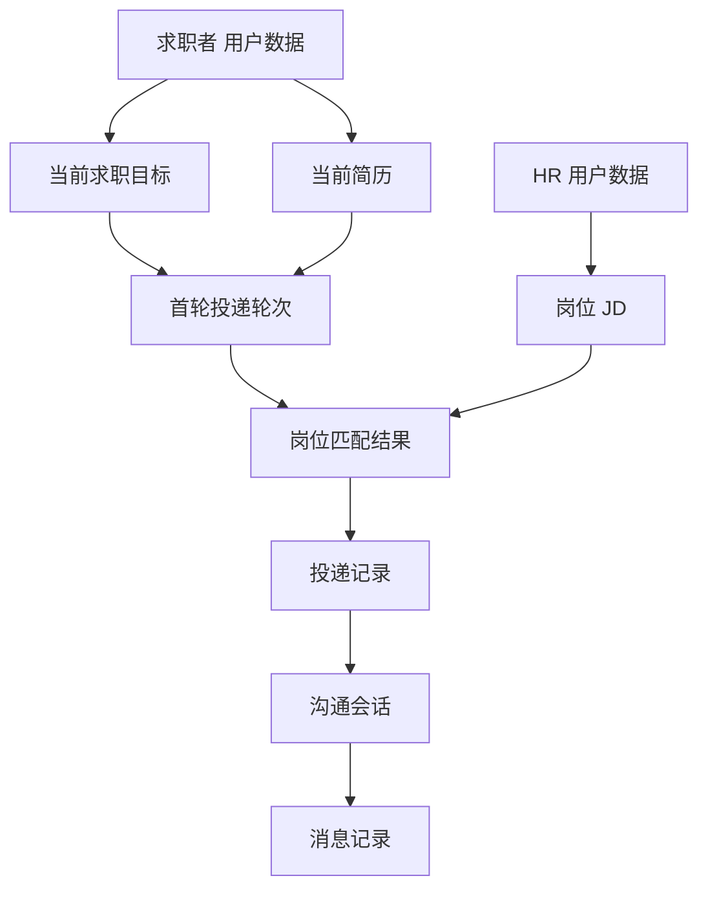
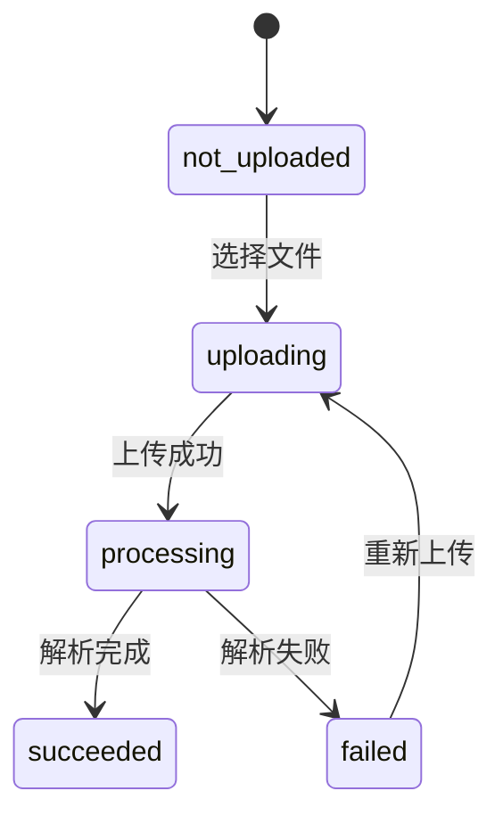
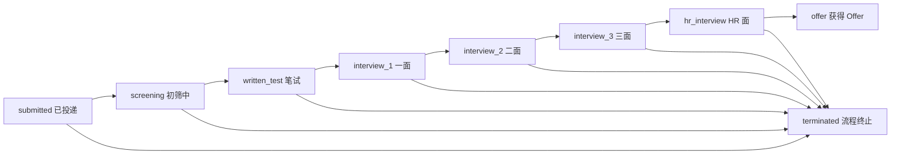

# Careerpass 前端 本地数据规范

## 1. 文档定位

本文档定义正式前端 MVP 使用的固定本地数据、数据关系、状态变化和数据恢复规则。

本地数据中的业务对象关系和状态只作为业务事实候选证据；跨前后端稳定语义以项目级 [`docs/business/business-baseline.md`](../../../docs/business/business-baseline.md) 为准，固定 ID、展示文本和 Mock 数据规模不进入业务基线。

数据用于支持以下完整验证闭环：

```text
HR 登录
→ 上传岗位 JD
→ 求职者登录
→ 上传简历并完成解析
→ 创建求职目标
→ 启动 Agent
→ 查看投递进度
→ HR 沟通并更新投递状态
→ Offer 达到目标
→ Agent 运行结束
```

本文档只定义前端 本地数据，不定义真实后端数据模型、数据库字段、接口协议或生产数据。

## 2. 数据使用原则

| 原则 | 说明 |
| --- | --- |
| 固定可复现 | 每次加载应用都能使用相同初始数据复现主流程 |
| 最小够用 | 只准备完成页面展示和主流程所需的数据 |
| 数据集中 | 用户、岗位、投递和消息不散落在页面组件中 |
| 状态可验证 | 数据必须支持加载、空、失败、成功、禁用和状态变化 |
| 角色可区分 | 求职者和 HR 使用不同 角色身份和可见页面 |
| 前端安全 | 不使用真实个人信息、联系方式、密码或敏感简历内容 |
| 原型解耦 | 正式前端不直接依赖 `prototypes/` 下的原型运行代码 |
| 可替换 | Mock 数据访问层未来可以替换为真实数据访问层 |

## 3. 数据集总览

### 3.1 最小数据规模

| 数据类型 | 初始规模 | 说明 |
| --- | --- | --- |
| 求职者 | 1 个 | 用于完成求职者主流程 |
| HR | 1 个 | 用于完成 HR 主流程 |
| 简历 | 1 份 | 当前求职任务绑定的简历 |
| 其它资料 | 0 至 2 份 | 用于展示附加资料上传结果 |
| 岗位 | 至少 1 个 | HR 上传或预置岗位 |
| 求职目标 | 1 个 | 当前求职者的目标 |
| 投递轮次 | 1 个 | 当前版本只验证首轮投递 |
| 投递记录 | 0 或多条 | 由投递轮次状态决定是否展示 |
| 沟通会话 | 0 或 1 个以上 | 只有已建立沟通的投递记录才有会话 |
| 消息 | 每个会话至少 1 条 | 支持 HR 消息和 Agent 回复 |

### 3.2 本地数据关系



## 4. 固定 角色身份

### 4.1 求职者

| 字段 | 本地数据值 | 用途 |
| --- | --- | --- |
| `id` | `candidate-001` | 关联简历、目标和投递记录 |
| `role` | `candidate` | 决定求职者导航和页面权限 |
| `displayName` | `林启明` | 页面展示名称 |
| `loginName` | `candidate.local` | 登录验证输入 |
| `password` | `local-only` | 仅用于前端验证，不作为真实凭证 |
| `avatar` | 可选占位图 | 头像展示 |

### 4.2 HR

| 字段 | 本地数据值 | 用途 |
| --- | --- | --- |
| `id` | `hr-001` | 关联岗位、会话和投递记录 |
| `role` | `hr` | 决定 HR 导航和页面权限 |
| `displayName` | `星河智能科技 HR` | 页面展示名称 |
| `loginName` | `hr.local` | 登录验证输入 |
| `password` | `local-only` | 仅用于前端验证，不作为真实凭证 |
| `companyName` | `星河智能科技` | 岗位和沟通页面展示 |

### 4.3 登录行为

| 场景 | 数据行为 | 页面结果 |
| --- | --- | --- |
| 求职者登录成功 | 设置当前身份为 `candidate-001` | 进入求职者欢迎页 |
| HR 登录成功 | 设置当前身份为 `hr-001` | 进入 HR 欢迎页 |
| 账号不存在 | 不修改当前身份 | 展示登录失败反馈 |
| 退出登录 | 清除当前身份 | 返回登录页 |
| 刷新页面 | 恢复当前 角色身份或回到未登录 | 不产生新业务数据 |

## 5. 简历和其它资料

### 5.1 当前简历

| 字段 | 本地数据值 |
| --- | --- |
| `id` | `resume-001` |
| `candidateId` | `candidate-001` |
| `fileName` | `林启明-后端与AI应用工程师-简历.pdf` |
| `fileType` | `pdf` |
| `version` | `1`，重新上传后递增 |
| `parseStatus` | 初始为 `not_uploaded`，上传后进入 `processing` |
| `matchingReadiness` | 解析成功后为 `ready` 或 `not_ready`；业务字段缺失时为 `not_ready` |
| `uploadedAt` | `2026-08-08T09:00:00+08:00` |
| `isBoundToRun` | Agent 启动后为 `true` |

简历内容使用脱敏摘要或固定展示文本，不在 本地数据中保存真实联系方式、住址、证件信息或完整个人隐私。

S-11 只对当前简历提供删除操作：解析任务为 `succeeded/failed` 且 Agent 尚未启动时可逻辑移除；`processing`、Agent 运行中或已结束时不可删除。Agent 尚未启动时，新上传的不同内容简历自动成为当前简历，解析未完成时不能启动 Agent。

### 5.2 其它求职资料

| `id` | `fileName` | 文件格式 | `uploadedAt` | 初始状态 |
| --- | --- | --- | --- | --- |
| `document-001` | `Python后端项目证书.pdf` | PDF | `2026-08-08T09:05:00+08:00` | `success` |
| `document-002` | `AI应用项目说明.pdf` | PDF | `2026-08-08T09:06:00+08:00` | `success` |

其它资料不进入简历解析流程。文件信息卡片与简历统一展示文件名、文件格式和上传时间；上传状态与文件格式通过独立状态信息表达。`ready` 仅表示数据存储尚未完成，已保存的本地资料使用 `success`。

成功保存的其它资料可在 Agent 各生命周期阶段逻辑删除；删除后从本地成功列表移除，不再用于新的资料检索。已发送附件的 7 天有效期由 S10-02 投影规则承接；已删除资料不参与重复上传幂等复用。

### 5.3 简历状态变化



| 状态 | 页面文案 | 允许操作 |
| --- | --- | --- |
| `not_uploaded` | 尚未上传简历 | 选择文件 |
| `uploading` | 上传中 | 等待上传完成 |
| `processing` | 简历解析中 | 页面保留当前内容并后台刷新状态，不进入整页 Loading |
| `succeeded` | 解析成功 | 创建求职目标；匹配资格另行判断 |
| `failed` | 解析失败 | 重新上传 |

## 6. 求职目标

### 6.1 当前求职目标

| 字段 | 本地数据值 |
| --- | --- |
| `id` | `goal-001` |
| `candidateId` | `candidate-001` |
| `targetOfferCount` | `1` |
| `jobTitle` | `AI Agent 工程师 / 大模型应用开发工程师` |
| `filterDescription` | `不考虑北京；优先深圳、杭州和广州；期望薪资不低于 20K` |
| `status` | 初始为 `not_created`，创建后为 `active` |
| `agentStatus` | 初始为 `not_started` |
| `createdAt` | `2026-08-08T09:10:00+08:00` |

### 6.2 启动条件

| 条件 | 判断依据 | 未满足时的表现 |
| --- | --- | --- |
| 已登录 | 当前存在求职者 角色身份 | 返回登录页 |
| 简历解析成功 | `parseStatus = succeeded` | 继续判断匹配资格；不影响目标保存 |
| 简历具备匹配资格 | `matchingReadiness = ready` | 继续判断目标；未满足时只展示尚未满足启动条件并禁用启动按钮，不展示资格详情 |
| 存在可用结构化 JD | 由 S-08 在匹配前检查 | 不属于 S-07 启动按钮判断 |
| 求职目标已创建 | 当前目标存在 | 启动按钮禁用 |
| 当前 Agent 未运行 | `agentStatus` 不是 `running` | 启动按钮禁用 |

## 7. 岗位数据

### 7.1 岗位来源

岗位数据分为两类：

| 来源 | 用途 |
| --- | --- |
| 预置岗位 | 保证求职者流程开始时存在可匹配岗位 |
| HR 上传岗位 | 验证 HR 上传岗位后的成功状态 |

S-02 页面不负责展示岗位结构化解析结果；S-02 演示只接受 `.md` 文件，页面逐文件展示上传文件名和“上传成功/上传失败”状态标识，不展示岗位摘要。岗位 Markdown 的结构化解析由 S-03 负责。

历史 Mock 数据仍可保留岗位对象字段供其他旧流程测试，但不得作为 S-02 页面或跨端业务事实依据。当前 S-02 页面只展示逐文件上传成功/失败结果，不展示岗位名称、公司、地点、薪资、版本、摘要或删除操作；岗位 JD 删除由 S-11 岗位管理交互承载，不在上传页实现。

当前 S-02 页面选择一份或多份 `.md` 文件后立即调用上传 Action；文件顺序用于对应逐文件上传结果。

### 7.2 主流程岗位

| 字段 | 本地数据值 |
| --- | --- |
| `id` | `job-001` |
| `title` | `AI Agent 工程师` |
| `companyName` | `星河智能科技` |
| `location` | `深圳` |
| `salaryRange` | `25-40K` |
| `jobNature` | `技术研发` |
| `employmentType` | `全职` |
| `interviewMode` | `线上/线下` |
| `jdStatus` | `ready` |
| `summary` | `负责企业级 AI Agent 应用的设计、开发与落地。` |

### 7.3 原型岗位 Mock 数据

`prototypes/reference-data/first-round-matching-jobs.js` 当前提供 20 个首轮岗位匹配结果，包含岗位基础信息、JD 摘要、匹配分数和推荐理由。

正式前端使用时：

- 该文件作为原型参考数据，不作为正式页面的直接依赖。
- 正式 Mock 层可以复用其中的岗位内容，但应转换为正式前端所需的最小数据结构。
- 匹配结果由匹配层独立保存；求职进度看板只展示通过投递筛选并生成投递记录的岗位，不展示未投递结果。
- 首轮岗位逐个执行筛选，不采用只选择 Top-N 岗位投递的策略。

前端本地数据只模拟最终可见的 Application；未投递 Match 可以作为测试内部数据存在，但不得映射为求职进度卡片。

## 8. 投递轮次和投递记录

### 8.1 首轮投递轮次

| 字段 | 本地数据值 |
| --- | --- |
| `id` | `match-run-001` |
| `jobGoalId` | `goal-001` |
| `resumeId` | `resume-001` |
| `status` | `running` 或 `completed`，按验证阶段变化 |
| `roundNumber` | `1` |
| `startedAt` | `2026-08-08T09:20:00+08:00` |
| `resultCount` | 初始为 `0`，启动后可变为 `3` |

### 8.2 投递轮次为 0

这是独立的空状态数据集，用于验证 Agent 已启动但尚未生成投递记录的页面：

| 数据项 | 值 |
| --- | --- |
| `roundNumber` | `1` |
| `resultCount` | `0` |
| `applications` | `[]` |
| 页面结果 | 本轮全部可用岗位筛选完成且 Application 数量为 `0` 时，展示“当前没有可供匹配的岗位”，不展示虚构岗位 |

### 8.3 首轮投递记录

正式验收可以使用以下 3 条投递记录，覆盖进行中、Offer 和流程终止状态：

| `id` | 岗位 | 初始状态 | 用途 |
| --- | --- | --- | --- |
| `application-001` | AI Agent 工程师 | `screening` | 展示进行中的主要岗位 |
| `application-002` | 大模型应用开发工程师 | `interview_1` | 展示面试阶段岗位 |
| `application-003` | 后端开发工程师（Python） | `terminated` | 展示终止记录长期保留 |

每条投递记录至少包含：

| 字段 | 示例 |
| --- | --- |
| `id` | `application-001` |
| `candidateId` | `candidate-001` |
| `jobId` | `job-001` |
| `goalId` | `goal-001` |
| `runId` | `match-run-001` |
| `resumeId` | `resume-001` |
| `status` | `screening` |
| `matchScore` | `0-100` 的推荐匹配得分 |
| `recommendationReason` | 由岗位画像、能力层级和技能匹配结果生成的规则模板理由 |
| `latestCommunicationAt` | `2026-08-08T10:20:00+08:00` |
| `createdAt` | `2026-08-08T09:30:00+08:00` |

真实 S-08 接入时，Application 列表来自 `GET /api/v1/applications/current`；查询结果不包含 Match 列表，只返回当前 Candidate 的投递记录和安全展示字段。

上述投递记录字段服务于求职者侧 S-08 进度看板。S-09 的 HR Mock 使用独立投影，只保留必要内部标识和以下字段：

| 字段 | 用途 |
| --- | --- |
| `id`、`jobId` | 更新请求和按岗位分组，不展示 |
| `jobTitle` | HR 页面展示岗位名称 |
| `companyName` | HR 页面展示公司名称 |
| `candidateName` | HR 页面展示候选人姓名 |
| `status` | HR 页面展示当前投递进度 |

`matchScore`、`recommendationReason` 等候选人侧字段不进入 HR 投影，也不因 S-09 从求职者侧数据中删除。

## 9. 求职进度状态

### 9.1 状态值和显示文案

| 状态值 | 页面文案 | 是否终态 |
| --- | --- | --- |
| `submitted` | 已投递 | 否 |
| `screening` | 初筛中 | 否 |
| `written_test` | 笔试 | 否 |
| `interview_1` | 一面 | 否 |
| `interview_2` | 二面 | 否 |
| `interview_3` | 三面 | 否 |
| `hr_interview` | HR 面 | 否 |
| `offer` | 获得 Offer | 是 |
| `terminated` | 流程终止 | 是 |

状态更新规则：时间轴的固定顺序仅用于展示所有可能阶段，不构成每个岗位的必经路径。非终态投递记录允许向后跳转到任一后续阶段，也允许进入 `terminated`；不允许回退到更早阶段，`offer` 和 `terminated` 进入终态后不可再次修改。

HR 状态选择控件只生成当前状态之后的阶段和 `terminated` 选项，不生成当前状态之前的回退选项；`offer` 和 `terminated` 记录不生成可修改控件。

### 9.2 状态迁移验证



当前本地数据环境中，HR 修改的是当前岗位下当前候选人的一条投递记录，不修改候选人全局状态或岗位全局状态。

HR 投递管理视图只使用以下页面字段：岗位名称、公司名称、候选人姓名和当前投递进度。`id`、`jobId` 等内部标识仅用于更新请求，不作为页面信息展示；联系方式、简历原文、匹配分数、推荐理由、沟通全文和其它候选人资料不进入 HR 视图。

本地 HR 数据只模拟当前 HR 所有未删除岗位下的当前首轮投递记录；查询失败保留失败反馈，查询无记录展示空状态，成功更新后刷新当前记录，终态记录继续展示但不可修改。

真实 HR 工作区不以页面局部上传结果作为岗位事实。正式 API 模式进入或刷新 HR 工作区时，分别调用 `GET /api/v1/jobs/hr/current` 和 `GET /api/v1/applications/hr/current`，将岗位映射为独立的 `HrJob` 投影，再展示岗位和投递数据。岗位投影包含上传文件名、岗位名称、公司名称、创建时间、解析状态和必要内部 ID，不包含 JD 原文、文件路径或对象键；岗位上传卡片优先展示上传文件名，不使用岗位名称代替。

退出登录或切换角色时清理旧工作区；新 Token 或角色进入后强制刷新，避免 HR 继承求职者数据或求职者继承 HR 岗位数据。401 清理登录态并返回登录页，403/404/409/400 按真实 API 错误语义展示。S10-01 接入真实 Conversation/Message API；本地 Mock 仅作为无 Token 的视觉 Fixture，不作为后端业务事实。

## 10. 沟通会话和消息

### 10.1 会话

| 字段 | 本地数据值 |
| --- | --- |
| `id` | `conversation-001` |
| `applicationId` | `application-001` |
| `jobId` | `job-001` |
| `candidateId` | `candidate-001` |
| `summary` | `HR 已开始了解候选人的 Agent 项目经验` |
| `lastMessageAt` | `2026-08-08T10:20:00+08:00` |

### 10.2 初始消息

真实 S10-01 Conversation 由 S-08 初始化为空消息容器，不自动写入欢迎消息；以下消息仅用于 Mock 视觉 Fixture。

| 顺序 | 角色 | 内容 | 展示目的 |
| --- | --- | --- | --- |
| 1 | `candidate_agent` | 您好，我对贵司 AI Agent 工程师岗位很感兴趣，希望进一步了解岗位的技术方向。 | 展示 Agent 主动沟通 |
| 2 | `hr` | 您好，方便介绍一下您最近参与的 Agent 项目和主要负责的部分吗？ | 展示 HR 提问 |
| 3 | `candidate_agent` | 我主要负责 Agent 工作流、工具调用和 RAG 检索链路的设计与实现。 | 展示 Agent 回复 |

### 10.3 新消息验证

HR 发送新消息后，Mock 层按以下顺序变化；真实 API 使用同一页面状态语义：

```text
输入框有内容
→ 点击发送
→ 新增 HR 消息
→ 展示 Agent 回复中
→ 延迟后新增系统回复
→ 更新会话最近消息时间
```

真实 S10-01 联调结果：HR 登录进入 `/hr/conversations` 后可读取 S-08 创建的空 Conversation；发送“你的工作经历中有包括大模型训练吗？”可显示明确无相关经历的 Agent 回答，发送技能问题可显示 Agent 正式回答，发送资料不支持的问题显示受控模板。发送请求携带稳定 `client_message_id`；失败时保留输入并允许重试，页面不展示 `fact_refs`、Prompt、模型原始响应、联系方式或文件定位。

### 10.4 S10-02 附件消息 Fixture

真实 API 的消息对象允许包含 `attachments` 数组；S10-02 成功交付的约束为一条 `content` 为空的 Agent 消息最多一个附件，附件卡片是唯一用户可见内容。Mock 只模拟以下安全投影，不模拟 CandidateDocument 正文或内部定位：

| 字段 | 示例 | 展示语义 |
| --- | --- | --- |
| `id` | `attachment-001` | 调用受保护下载接口的附件标识 |
| `file_name` | `candidate_certificate.pdf` | 文件名 |
| `file_type` | `pdf` | 文件格式 |
| `file_size_bytes` | `20480` | 文件大小 |
| `created_at` | `2026-08-20T10:00:00+08:00` | 附件创建时间 |
| `expires_at` | `2026-08-27T10:00:00+08:00` | 创建后 7 天的失效时间 |
| `status` | `downloadable` / `expired` | 可下载或已过期状态 |

前端只提供下载，不提供在线预览；附件卡片按仿微信接收文件效果呈现，不能在附件上方或同一消息气泡中追加“已为你找到”等成功提示语。下载中、成功、失败和过期状态以真实沟通页为准。下载不要求额外确认或重新登录，但真实 API 仍按当前 HR、Application 和 Conversation 归属校验。Mock Fixture 与 `IC-S10-AI-COMMUNICATION@0.4` 保持同一字段和状态语义。

示例 HR 消息：

```text
这个项目中你是如何处理工具调用失败和任务重试的？
```

示例 Agent 回复：

```text
我们对工具输入做结构化校验，并将可重试失败与确定性失败分开处理；每次运行都会记录任务状态，避免重复执行产生副作用。
```

## 11. Agent 状态和数据变化

| Agent 状态 | 触发事件 | 数据变化 | 页面结果 |
| --- | --- | --- | --- |
| `not_started` | 目标未创建或简历/画像启动条件未全部满足 | 目标可以已保存；简历或画像条件可能仍未完成 | 启动按钮禁用 |
| `ready` | 目标已创建、简历解析成功且画像具备匹配资格 | 目标状态为可启动 | 启动按钮可用 |
| `running` | 用户点击启动 | S-07 将当前简历绑定到运行上下文并提交；S-08 在事务提交后同步完成岗位筛选、匹配和投递 | 页面不展示匹配过程，进入进度页查看结果 |
| `running` | S-08 完成岗位匹配并创建投递记录 | `applications` 从空变为有记录；Application 带有推荐匹配得分和推荐理由 | 看板展示投递数据 |
| `running` | HR 更新非终态 | 对应投递记录状态变化 | 求职者侧进度刷新 |
| `running` | HR 更新为 `offer` | Offer 数量增加 | 重新检查目标数量 |
| `finished` | Offer 数量达到目标 | Agent 结束，目标标记完成；其它未终态 Application 仍可继续更新 | 启动按钮禁用 |
| `finished` | 全部可用岗位筛选完成且 `applications` 数量为 `0` | Agent 以 `no_match` 原因结束 | 展示“当前没有可供匹配的岗位” |

## 12. 页面状态数据集

正式前端至少需要支持以下可切换数据集：

| 数据集 | 用途 |
| --- | --- |
| `default` | 主流程初始数据，展示可操作页面 |
| `resume-processing` | 展示简历解析中 |
| `resume-failed` | 展示简历解析失败和重试 |
| `empty-applications` | 展示本轮全部可用岗位筛选完成且 Application 数量为 0 的空状态 |
| `applications-active` | 展示进行中的投递记录 |
| `applications-finished` | 展示 Offer 达标和 Agent 已结束 |
| `conversation-loading` | 展示沟通记录加载中 |
| `conversation-failed` | 展示消息发送或加载失败 |
| `job-upload-empty` | 展示 HR 尚未上传岗位 |
| `job-upload-success` | 展示岗位上传成功 |

数据集切换可以通过开发模式配置、本地数据操作或测试夹具完成，不应由页面组件自行复制数据。

## 13. 重置和变更规则

真实联调的账号级恢复由 S-DBG 后端能力负责；本节的 `resetData()` 仅恢复前端 Mock 快照，不删除 PostgreSQL、Redis 或对象存储中的真实数据。

### 13.1 重置规则

每次重新加载应用或执行数据恢复时：

1. 恢复固定用户和角色状态。
2. 恢复简历为未上传或预设解析成功状态，按当前验证场景决定。
3. 恢复求职目标为初始配置状态。
4. 恢复 Agent 为 `not_started`。
5. 恢复投递轮次和投递记录初始快照。
6. 恢复会话和消息初始内容。
7. 清除当前流程产生的临时消息和状态变化。

### 13.2 运行时变更

| 变更 | 是否持久化 | 说明 |
| --- | --- | --- |
| 登录身份 | 当前工作区会话内 | Token/角色变化时清理旧工作区并从真实 API 恢复 |
| 简历解析状态 | 当前 工作区会话内 | 支持成功和失败路径切换 |
| 求职目标 | 当前 工作区会话内 | 只保留一个当前目标 |
| 投递状态 | 当前 工作区会话内 | 只影响对应投递记录 |
| HR 新消息 | 当前 工作区会话内 | 追加到当前会话 |
| Agent 回复 | 当前 工作区会话内 | 使用固定回复模板 |
| 真实文件 | 由后端持久化 | 前端只展示安全投影，不保存原文、路径或对象键 |

## 14. 数据验收清单

- [ ] 求职者和 HR 使用不同的固定 角色身份。
- [ ] 主流程开始前存在至少一个可用岗位。
- [ ] 简历支持未上传、解析中、成功和失败状态。
- [ ] 求职目标不与简历绑定；启动 Agent 时投递轮次绑定当时有效的当前简历。
- [ ] Agent 未启动时目标可更新，运行中或已结束后目标不可修改。
- [ ] Agent 启动后绑定当前简历，运行中不能替换。
- [ ] 本轮全部可用岗位筛选完成且 Application 数量为 0 时展示“当前没有可供匹配的岗位”，不展示虚构记录。
- [ ] 有投递记录时至少覆盖进行中、Offer 或流程终止中的代表状态。
- [ ] 有投递记录时展示推荐匹配得分和推荐理由。
- [ ] HR 可以只修改单条投递记录的进度。
- [ ] HR 进度页只展示岗位名称、公司名称、候选人姓名和当前投递进度。
- [ ] 沟通会话至少包含 HR 消息和 Agent 回复。
- [ ] 消息发送支持发送中、成功和失败重试状态。
- [ ] Offer 达到目标，或本轮全部可用岗位筛选完成且 Application 数量为 0 后 Agent 进入结束状态。
- [ ] Offer 达标后其它未终态 Application 仍可继续更新。
- [ ] 数据恢复后数据恢复到初始快照。
