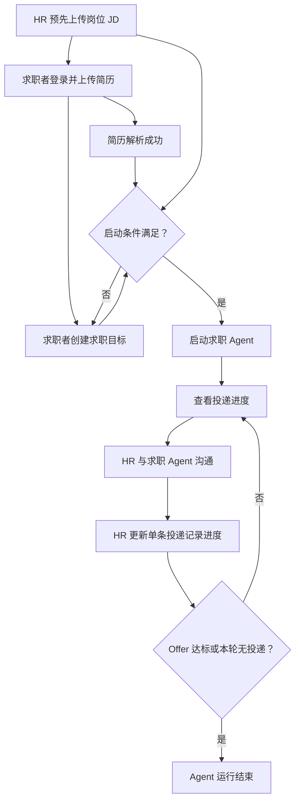
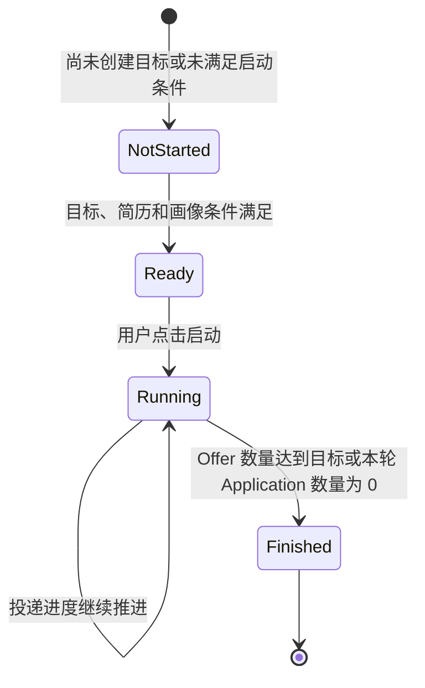
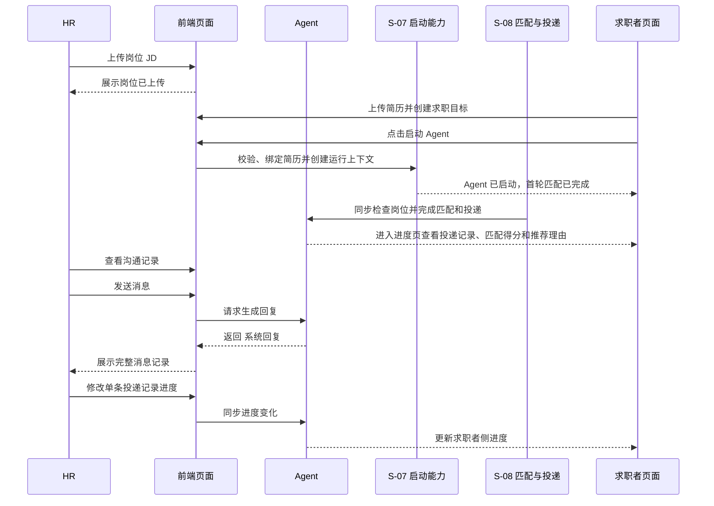
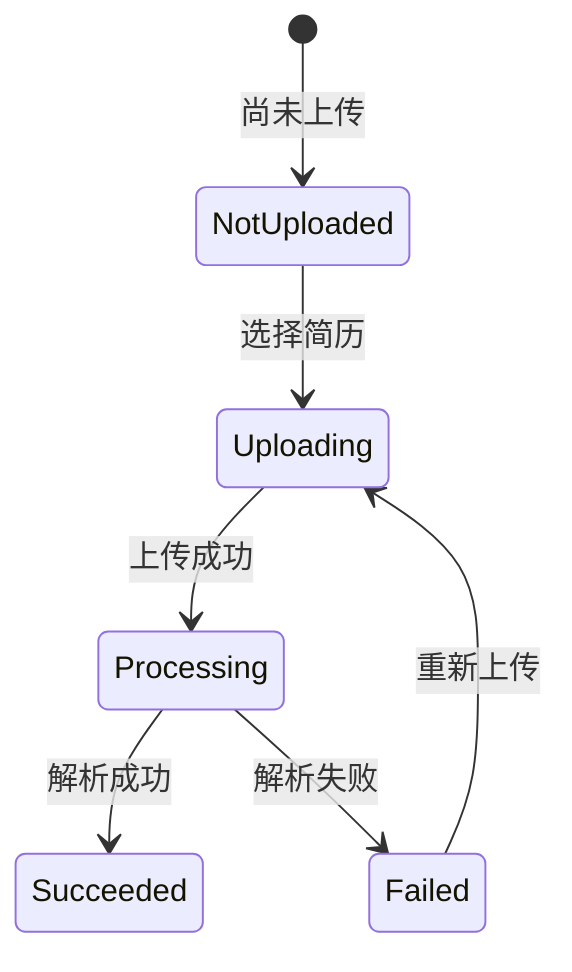
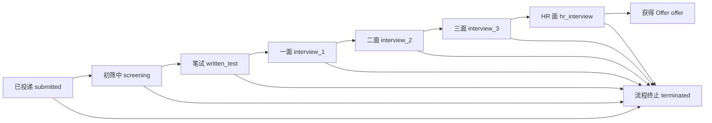

# 前端标准流程与验收

## 1. 文档定位

本文档定义 Careerpass 前端原型需要呈现的角色、页面流程、状态变化和验收范围。

跨前后端共享的角色、流程、业务对象、状态和规则必须同步提取到项目级 [`docs/business/business-baseline.md`](../../../docs/business/business-baseline.md)；本文件保留前端流程和验收证据，不作为后端 Slice 重新猜测业务事实的唯一入口。

本文档关注“用户看到什么、用户如何操作、页面如何流转”，不定义前端技术实现、视觉细节、真实后端接口或生产环境能力。

相关内容分别见：

| 内容 | 文档 |
| --- | --- |
| 正式前端产品形态、页面职责和交互 | `docs/product/frontend-product-flow.md` |
| UI/UX 和视觉规范 | `docs/design/design-guidelines.md` |
| 本地数据和数据变化 | `docs/development/local-data-spec.md` |
| 技术选型、路由和状态管理 | `docs/architecture/frontend-architecture.md` |
| 范围取舍和重要决策 | `docs/decisions/frontend-development-decisions.md` |
| 跨前后端业务事实 | `../../../docs/business/business-baseline.md` |
| S-08 匹配与投递契约 | `../../../docs/integration/slices/slice-08-job-matching/integration-contract.md` |

## 2. 角色与核心对象

### 2.1 参与角色

| 角色 | 主要职责 | 前端可见范围 |
| --- | --- | --- |
| 求职者 | 上传资料、创建求职目标、启动 Agent、查看投递进度 | 求职者首页、资料页、任务页、进度页 |
| HR | 上传岗位 JD、查看沟通、更新投递进度 | HR 首页、岗位上传页、沟通页、进度管理页 |
| 求职 Agent | 执行匹配、投递、沟通和进度推进 | 无独立页面，通过任务状态、投递记录和沟通状态体现 |

### 2.2 核心对象

| 对象 | 所属角色 | 用途 |
| --- | --- | --- |
| 简历 | 求职者 | 作为匹配、投递和沟通的基础资料 |
| 其它求职资料 | 求职者 | 保存证书等附加资料，当前版本只展示上传结果 |
| 求职目标 | 求职者 | 定义目标 Offer 数量、岗位名称和过滤条件 |
| 岗位 JD | HR | 提供可投递岗位及岗位信息 |
| 投递记录 | 求职者、HR | 表示某个候选人对某个岗位的一次投递 |
| 沟通会话 | HR | 展示 HR 与求职 Agent 的完整消息记录 |
| 求职进度 | 求职者、HR | 表示一条投递记录当前所处的招聘阶段 |

## 3. 当前版本产品范围

### 3.1 产品目标

当前版本只验证以下可重复验收的闭环：

### 3.2 范围清单

| 当前版本包含 | 当前版本不包含 |
| --- | --- |
| 求职者和 HR 登录 | 真实账号体系和复杂注册流程 |
| 求职者上传 PDF 简历并展示解析状态 | 生产级文件中心、扫描件/OCR 和受保护 PDF 处理 |
| 求职者上传其它求职资料 | 资料删除、回收站和复杂文件管理 |
| 创建单个求职目标 | 多个求职目标并行管理 |
| 启动 Agent 并展示生命周期 | 用户手动暂停或终止 Agent |
| 首轮匹配、投递结果和进度看板 | 多轮投递和完整自动调度 |
| HR 上传岗位 JD | 复杂岗位管理和岗位编辑能力 |
| HR 沟通和系统回复 | 实时推送和真实 AI 沟通 |
| HR 修改单条投递记录状态 | 将状态修改为候选人或岗位的全局状态 |
| 成功、空、加载、失败和禁用状态 | 生产级监控、运营和高可用能力 |

### 3.3 验收前提数据

| 数据项 | 产品要求 |
| --- | --- |
| HR 账号 | 使用固定 角色账号 |
| 求职者账号 | 使用固定 角色账号 |
| 岗位 JD | 求职者主流程开始前，至少存在一个已上传岗位 |
| 简历 | 求职者上传后进入解析状态 |
| 求职目标 | 求职者创建一个目标 Offer 数量和岗位条件 |
| 投递记录 | 仅在已开启投递轮次大于 0 时展示 |
| 消息记录 | 使用固定的 HR 消息和 Agent 回复进行验证 |

## 4. 主流程总览

### 4.1 标准流程

| 顺序 | 角色 | 操作 | 结果 |
| --- | --- | --- | --- |
| 1 | HR | 登录并上传岗位 JD | 系统具备可投递岗位 |
| 2 | 求职者 | 登录并上传简历 | 简历进入解析流程 |
| 3 | 求职者 | 等待简历解析完成 | 解析成功后进入任务页；是否满足启动条件由任务页统一表达 |
| 4 | 求职者 | 创建求职目标 | 目标配置完成 |
| 5 | 求职者 | 启动 Agent | S-07 校验并提交运行上下文；S-08 同步完成匹配和投递 |
| 6 | 求职者 | 查看求职进度 | 查看 S-08 生成的投递记录、推荐匹配得分、推荐理由和指标 |
| 7 | HR | 查看沟通并发送消息 | 对话记录更新 |
| 8 | HR | 修改单条投递记录进度 | 求职者侧进度同步变化 |
| 9 | 系统 | 检查 Offer 数量或本轮是否无投递 | Agent 保持运行中，或在 Offer 达标/本轮无投递时进入结束状态 |

### 4.2 Agent 生命周期

| 状态 | 进入条件 | 页面表现 | 用户可执行操作 |
| --- | --- | --- | --- |
| 未启动 | 尚未完成目标配置或尚未点击启动 | 展示未满足条件 | 完成目标配置或启动条件 |
| 可启动 | 简历解析成功、画像具备匹配资格且求职目标已创建 | 启动按钮可用 | 点击启动 Agent |
| 运行中 | Agent 已启动、Offer 未达目标且本轮仍有后续流程 | 展示运行中 | 查看进度；不能替换当前简历 |
| 已结束 | Offer 数量达到或超过目标，或本轮全部可用岗位筛选完成且 Application 数量为 0 | 展示运行结束 | 不能再次启动当前任务 |

## 5. 求职者流程

### 5.1 求职者步骤表

| 步骤 | 页面 | 前置条件 | 用户操作 | 系统或 Agent 行为 | 页面结果 |
| --- | --- | --- | --- | --- | --- |
| 1 | 登录页 | 用户未登录 | 选择求职者身份并登录 | 校验 角色账号 | 进入求职者首页 |
| 2 | 资料页 | 用户已登录 | 上传一份简历 | 简历进入解析流程 | 展示上传成功和解析中 |
| 3 | 资料页 | 简历正在解析 | 刷新或等待状态变化 | 解析成功或失败 | 展示解析终态；匹配资格不在资料页展示 |
| 4 | 资料页 | 用户已登录 | 批量上传其它求职资料 | 保存逐文件上传结果 | 上传中展示处理状态，成功资料进入列表，失败文件通过一次性 error Snackbar/Toast 提示，不执行解析 |
| 5 | 任务页 | 用户已登录 | 填写目标 Offer 数、岗位名称和过滤条件 | 保存求职目标 | 展示目标创建或更新成功 |
| 6 | 任务页 | 目标已创建、简历解析成功且画像具备匹配资格 | 点击启动 Agent | S-07 绑定当前简历并提交运行上下文；S-08 同步检查岗位、执行匹配和投递 | 启动完成；结果进入求职进度页 |
| 7 | 进度页 | Agent 已启动 | 查看当前投递轮次 | 展示投递数量、Offer 数量和岗位进度 | 页面保持在进度看板 |
| 8 | 进度页 | HR 更新投递状态 | 查看刷新后的状态 | 系统同步进度并检查 Offer 数量 | 更新对应岗位的进度 |
| 9 | 任务页或进度页 | Offer 达到目标，或本轮全部可用岗位筛选完成且 Application 数量为 0 | 无需手动结束 | 系统结束 Agent | 展示 Agent 运行结束 |

### 5.2 求职者页面状态

| 场景 | 页面表现 |
| --- | --- |
| 未登录 | 不能进入求职者业务页面，返回登录页 |
| 简历未上传 | 展示上传引导，启动按钮不可用 |
| 简历解析中 | 展示处理中状态，启动按钮不可用 |
| 简历解析失败 | 展示失败状态和重新上传入口 |
| 简历解析成功且字段完整 | 展示可用简历；目标和画像条件满足后可启动 Agent |
| 简历解析成功但画像条件未满足 | 允许创建或更新目标；任务页统一展示尚未满足启动条件，不展示匹配资格详情 |
| 简历未上传或仍在解析 | 允许保存求职目标；Agent 启动按钮禁用 |
| 求职目标未创建 | 展示待完成条件，启动按钮不可用 |
| 求职目标已保存但简历或画像条件未满足 | 展示已保存目标和“尚未满足启动条件”，启动按钮禁用；不展示匹配资格详情 |
| Agent 尚未启动 | 进度页展示“求职进程尚未开始” |
| Agent 已启动但无投递 | 本轮全部可用岗位已筛选完成且 Application 数量为 0 时，进度页展示“当前没有可供匹配的岗位”；未形成投递记录的匹配结果不展示 |
| Agent 运行中 | 展示当前轮次和投递岗位进度 |
| Agent 已结束 | 展示目标达成或“当前没有可供匹配的岗位”和运行结束，启动按钮禁用 |

### 5.3 求职者进度看板指标

| 指标 | 含义 |
| --- | --- |
| 本轮投递数量 | 当前投递轮次新增的岗位数量 |
| 累计投递数量 | 历史所有轮次的投递总数量；当前版本可与本轮数量保持一致 |
| 进行中岗位数 | 当前招聘流程尚未结束的岗位数量 |
| 已获得 Offer 数 | 当前状态为获得 Offer 的投递数量 |
| 目标 Offer 数 | 求职者在求职目标中设置的目标数量 |

## 6. HR 流程

### 6.1 HR 步骤表

| 步骤 | 页面 | 前置条件 | 用户操作 | 系统或 Agent 行为 | 页面结果 |
| --- | --- | --- | --- | --- | --- |
| 1 | 登录页 | HR 未登录 | 选择 HR 身份并登录 | 校验 角色账号 | 进入 HR 首页 |
| 2 | 岗位上传页 | HR 已登录 | 选择一份或多份 `.md` 岗位 JD | 选择完成后立即保存岗位数据 | 逐文件展示上传文件名及“上传成功/上传失败”状态标识 |
| 3 | 沟通页 | 存在已发起沟通的投递记录 | 选择岗位和候选人 | 加载完整消息记录 | 展示聊天窗口 |
| 4 | 沟通页 | 当前会话可用 | 输入消息并发送 | 系统 Agent 回复 | 展示发送中和回复完成 |
| 5 | 投递进度页 | 存在投递记录 | 查看岗位名称、公司名称、候选人姓名和当前进度，并选择合法后续状态 | 保存状态变化 | 刷新当前记录 |
| 6 | 求职者进度页 | HR 已完成状态更新 | 查看求职者侧数据 | 系统检查 Offer 数量 | 进度和 Agent 状态同步变化 |

### 6.2 HR 页面状态

| 场景 | 页面表现 |
| --- | --- |
| 未登录 | 不能进入 HR 业务页面，返回登录页 |
| 尚未上传岗位 | 岗位上传页展示上传引导 |
| 岗位已上传 | 逐文件展示上传文件名和“上传成功/上传失败”状态标识 |
| 尚未发起沟通 | 沟通页不展示可交互的会话 |
| Agent 正在回复 | 输入区或发送按钮展示处理中状态，避免重复发送 |
| 消息发送失败 | 保留原输入内容并展示重试反馈 |
| 没有投递记录 | 投递进度页展示空状态 |
| 存在投递记录 | 按岗位归类展示候选人、当前进度和状态选择控件 |

HR 投递进度页仅展示岗位名称、公司名称、候选人姓名和当前投递进度；不展示联系方式、简历原文、匹配分数、推荐理由、沟通全文或其它候选人资料。

## 7. 跨角色协作流程

协作边界如下：

| 操作 | 负责角色 | 影响对象 |
| --- | --- | --- |
| 上传岗位 JD | HR | 岗位数据 |
| 上传简历 | 求职者 | 当前简历 |
| 启动 Agent | 求职者 | 当前求职目标和投递轮次 |
| 发送 HR 消息 | HR | 当前岗位下当前候选人的会话 |
| 回复消息 | Agent | 当前会话消息记录 |
| 修改投递状态 | HR | 当前岗位下当前候选人的一条投递记录 |
| 判定 Agent 结束 | 系统 | 当前求职目标和 Agent 状态 |

## 8. 关键状态和状态迁移

### 8.1 简历状态

### 8.2 投递进度

| 状态值 | 页面显示文案 | 是否终态 |
| --- | --- | --- |
| `submitted` | 已投递 | 否 |
| `screening` | 初筛中 | 否 |
| `written_test` | 笔试 | 否 |
| `interview_1` | 一面 | 否 |
| `interview_2` | 二面 | 否 |
| `interview_3` | 三面 | 否 |
| `hr_interview` | HR 面 | 否 |
| `offer` | 获得 Offer | 是 |
| `terminated` | 流程终止 | 是 |

`terminated` 在当前版本统一显示为“流程终止”，不在不同页面无说明地混用“被拒绝”等文案。

时间轴用于展示系统支持的完整招聘阶段顺序，不代表每个岗位必须逐项经过所有阶段。HR 更新投递进度时，非终态可以直接跳转到时间轴后方的任一阶段，以适配不同公司的招聘流程；不允许回退到更早阶段，已获得 Offer 或流程终止的记录不可再次修改。

Agent 因 Offer 达标结束后，其它未终态投递记录仍允许 HR 继续推进；Agent 本身不能重新启动。

HR 页面只查询当前 HR 所有未删除岗位下的当前首轮投递记录；状态选择控件只提供当前状态之后的阶段和“流程终止”，不展示非法回退选项，Offer 和流程终止记录不提供修改操作。

## 9. 全局交互规则

### 9.1 认证和角色规则

| 规则 | 页面行为 |
| --- | --- |
| 登录页同时支持两种身份 | 通过选项卡切换求职者和 HR 登录身份 |
| 未登录用户 | 不能进入业务页面，返回登录页 |
| 已登录用户退出 | 通过侧边栏或用户菜单退出，并返回登录页 |
| 角色菜单隔离 | 求职者和 HR 只展示各自可用的页面菜单 |
| 注册流程 | 作为非主流程或可选扩展，不阻塞主流程 |

### 9.2 表单和异步交互规则

| 规则 | 页面行为 |
| --- | --- |
| 未选择文件 | 不执行上传，保留当前页面 |
| 上传或提交进行中 | 禁止重复提交，并展示处理中状态 |
| 操作成功 | 展示成功反馈并刷新相关数据 |
| 操作失败 | 展示可理解的失败反馈，并提供可行的重试入口 |
| 没有数据 | 展示明确空状态，不使用虚构业务记录填充 |
| 状态不可用 | 按钮或控件禁用，并说明未满足的条件 |

### 9.3 资料和任务规则

| 规则 | 说明 |
| --- | --- |
| 简历与其它资料分开 | 简历需要解析，其它资料当前版本只展示上传结果 |
| 批量资料上传 | 支持批量或分批追加，逐文件处理，单项失败不影响其他成功项 |
| 求职目标与简历 | 目标不绑定简历；Agent 启动时将当前简历绑定到本轮运行 |
| 求职目标更新 | Agent 未启动时更新同一个当前目标；运行中或已结束后不可修改 |
| Agent 运行中 | 不能替换当前投递轮次绑定的简历 |
| Agent 已结束 | 历史投递继续保留，当前任务不能再次启动 |
| 更换简历 | 不修改历史投递，应通过新的任务或投递轮次体现 |

### 9.4 投递和沟通规则

| 规则 | 说明 |
| --- | --- |
| 投递记录粒度 | 一条记录只表示一个候选人对一个岗位的投递 |
| HR 修改范围 | 只修改当前岗位下当前候选人的一条投递记录 |
| 沟通展示范围 | 完整消息记录只在 HR 侧展示 |
| 求职者侧沟通 | 不展示单个岗位的完整聊天内容，只展示沟通状态 |
| 进度结束记录 | 流程终止和获得 Offer 的记录继续保留在看板 |
| Agent 结束判定 | HR 不直接结束 Agent；系统根据 Offer 数量，或本轮全部可用岗位筛选完成且 Application 数量为 0 判定结束 |

## 10. 页面流转关系

| 当前页面 | 操作或事件 | 条件 | 下一页面或结果 |
| --- | --- | --- | --- |
| 登录页 | 登录成功 | 角色账号有效 | 对应角色首页 |
| 任意业务页 | 退出登录 | 当前用户已登录 | 登录页 |
| 资料页或首页 | 用户已登录 | 当前用户进入任务页 | 任务页可创建或更新目标；简历解析状态只影响启动条件 |
| 资料页 | 上传其它资料 | 文件选择完成 | 逐文件展示 `ready`、`success` 或 `failed` 结果；成功资料进入列表 |
| 任务页 | 创建或更新求职目标 | 表单填写有效 | 启动条件重新计算 |
| 任务页 | 点击启动 Agent | 目标已创建、简历解析成功且画像具备匹配资格 | S-07 提交运行上下文，S-08 同步完成匹配和投递 |
| 进度页 | Agent 尚未启动 | 当前任务未启动 | 展示未开始空状态 |
| 进度页 | Agent 已启动但无投递 | 本轮全部可用岗位筛选完成且 Application 数量为 0 | 展示当前没有可供匹配的岗位 |
| HR 岗位页 | 上传岗位 JD | 选择 `.md` 文件完成 | 立即上传并展示上传结果 |
| HR 沟通页 | 发送消息 | 当前会话可用 | 展示消息和 Agent 回复 |
| HR 进度页 | 修改投递状态 | 当前记录存在 | 刷新当前投递记录 |
| 求职者进度页 | Agent 结束 | Offer 数量达到目标值，或本轮全部可用岗位筛选完成且 Application 数量为 0 | 展示目标达成或无可供匹配岗位和 Agent 已结束 |

## 11. 页面与侧边栏清单

| 角色 | 页面 | 侧边栏菜单 | 页面职责 |
| --- | --- | --- | --- |
| 公共 | 登录页 | 无 | 选择身份并登录 |
| 公共 | 注册页 | 无 | 非主流程的静态页面或可选扩展 |
| 求职者 | 欢迎页 | 首页 | 展示产品引导和当前任务摘要 |
| 求职者 | 资料上传页 | 求职资料上传 | 管理简历和其它求职资料 |
| 求职者 | 任务配置页 | 求职任务创建 | 创建目标并启动 Agent |
| 求职者 | 进度看板 | 求职进度查看 | 查看投递记录、指标和进度 |
| HR | 欢迎页 | 首页 | 展示 HR 侧操作引导和岗位摘要 |
| HR | 岗位上传页 | 岗位上传 | 上传和展示岗位 JD |
| HR | 沟通页 | 求职沟通 | 查看会话并发送消息 |
| HR | 投递进度页 | 投递进度管理 | 按岗位查看并更新投递进度 |

## 12. 验收清单

### 登录和导航

- [ ] 登录页可以切换求职者和 HR 身份。
- [ ] 求职者登录后只看到求职者菜单。
- [ ] HR 登录后只看到 HR 菜单。
- [ ] 用户可以退出并返回登录页。

### 求职者主流程

- [ ] 求职者可以上传一份简历。
- [ ] 简历可以展示上传成功、解析中、解析成功和解析失败状态。
- [ ] 求职者可以批量上传 PDF、Markdown、JPG 或 PNG 附加资料；上传中展示 `ready`，成功资料进入列表，失败文件通过一次性 error Snackbar/Toast 提示且不提供重试入口。
- [ ] 单个附加资料超过 10 MB 或格式不支持时上传失败，其他文件的成功结果不受影响。
- [ ] 简历解析未成功或画像不具备匹配资格时，Agent 启动按钮不可用；页面不展示匹配资格详情。
- [ ] 求职者可以在简历解析完成前创建求职目标。
- [ ] Agent 未启动时，求职者可以更新同一个当前目标；运行中或已结束后目标不可修改。
- [ ] 目标创建时不绑定简历，Agent 启动时绑定当时有效的当前简历。
- [ ] 求职目标创建后，页面展示启动条件。
- [ ] 满足条件后可以启动 Agent。
- [ ] Agent 启动后展示运行中。
- [ ] 启动链路不展示匹配中间过程，结果通过求职进度页读取。
- [ ] 求职进度页只展示 Application，不展示未投递 Match。
- [ ] 本轮全部可用岗位筛选完成且 Application 数量为 0 时展示当前没有可供匹配的岗位。
- [ ] 存在投递记录时展示推荐匹配得分和推荐理由。
- [ ] 存在投递记录时展示岗位进度和看板指标。
- [ ] Agent 运行中不能替换当前简历。
- [ ] Offer 达到目标，或本轮全部可用岗位筛选完成且 Application 数量为 0 后展示 Agent 运行结束，启动按钮保持禁用。

S-07 任务页的双栏布局、目标只读状态和启动交互以 [`../development/slice-07-agent-start.md`](../development/slice-07-agent-start.md) 的状态矩阵为验收依据。

### HR 主流程

- [ ] HR 可以上传岗位 JD。
- [ ] 岗位上传后逐文件展示上传文件名和“上传成功/上传失败”状态标识。
- [ ] HR 退出并重新登录后，岗位上传卡片仍展示已保存岗位的原始文件名。
- [ ] 存在已发起沟通时，HR 可以进入对应会话。
- [ ] HR 可以查看完整消息记录。
- [ ] HR 发送消息后展示发送中和 Agent 回复状态。
- [ ] 消息失败时可以重试。
- [ ] HR 可以按岗位查看投递记录。
- [ ] HR 页面只展示岗位名称、公司名称、候选人姓名和当前投递进度。
- [ ] HR 修改状态时只影响当前岗位下当前候选人的一条投递记录。
- [ ] 投递进度更新后，求职者侧可以看到对应状态变化。
- [ ] Offer 达标后 Agent 结束，但其它未终态投递记录仍可继续更新。

### 通用状态

- [ ] 页面具备加载状态。
- [ ] 页面具备空状态。
- [ ] 页面具备失败状态。
- [ ] 页面具备成功反馈。
- [ ] 异步操作期间不会重复提交。
- [ ] 投递状态文案与状态值映射一致。
