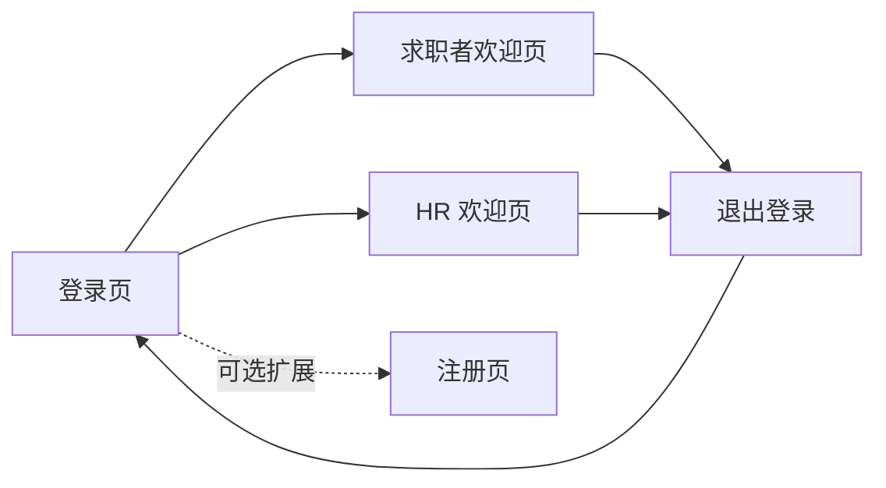
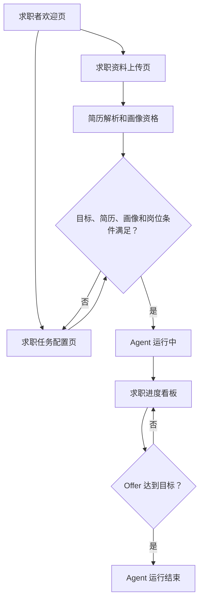
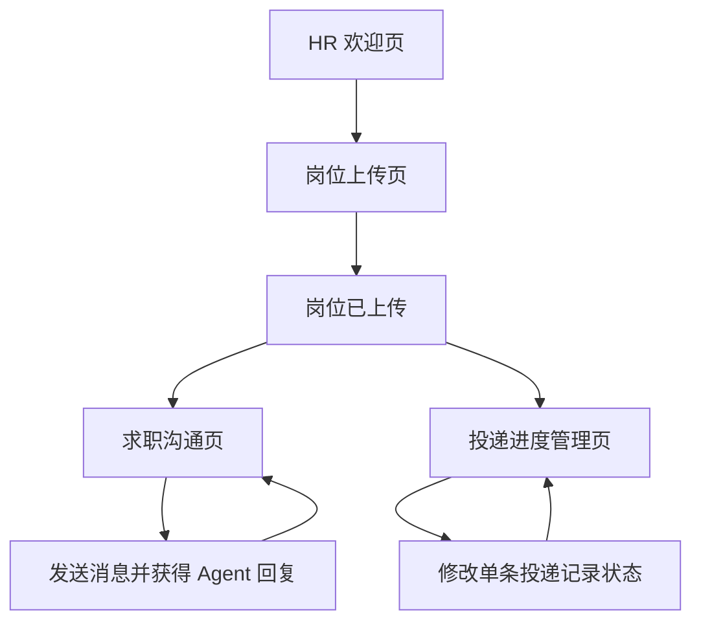

# 前端正式产品形态与页面规格

## 1. 文档定位

本文档定义 Careerpass 正式前端 MVP 的产品形态、页面结构、页面职责、核心展示内容和主要交互。

其中涉及用户操作、业务结果、对象关系、状态和跨角色规则的内容，应同步到项目级 [`docs/business/business-baseline.md`](../../../docs/business/business-baseline.md)；页面布局和展示细节只保留在本文档。

本文档承接以下内容：

- `frontend-acceptance-flow.md`：定义原型参考流程、角色流程和产品规则。
- `docs/decisions/frontend-development-decisions.md`：定义正式前端的开发目标和范围。

本文档不定义具体技术实现、组件代码、Mock 数据格式和视觉参数。相关内容分别由架构、本地数据和设计规范文档定义。

## 2. 正式前端产品形态

### 2.1 整体布局

正式前端采用统一应用外壳：

```text
┌──────────────────────────────────────────────────────────────┐
│                         顶部区域                             │
├───────────────┬──────────────────────────────────────────────┤
│               │                                              │
│   侧边导航     │                 页面内容区域                  │
│               │                                              │
│               │                                              │
└───────────────┴──────────────────────────────────────────────┘
```

| 区域 | 职责 |
| --- | --- |
| 顶部区域 | 展示当前页面上下文、当前用户和退出入口 |
| 侧边导航 | 展示当前角色可访问的页面菜单 |
| 页面内容区 | 展示当前页面的业务内容和操作 |
| 反馈区域 | 展示成功、失败、加载和操作提示 |

### 2.2 角色形态

| 角色 | 默认入口 | 导航菜单 |
| --- | --- | --- |
| 求职者 | 求职者欢迎页 | 首页、求职资料上传、求职任务创建、求职进度查看 |
| HR | HR 欢迎页 | 首页、岗位上传、求职沟通、投递进度管理 |

登录页共用，通过身份选项卡选择求职者或 HR。登录后只展示当前角色对应的导航和页面。

## 3. 页面总览

### 3.1 公共页面

| 页面 | 页面职责 | 是否属于主流程 |
| --- | --- | --- |
| 登录页 | 选择身份并进入系统 | 是 |
| 注册页 | 展示注册形态和可选扩展入口 | 否 |
| 错误或未授权页 | 展示无法访问或页面异常 | 辅助能力 |

### 3.2 求职者页面

| 页面 | 页面职责 | 主要结果 |
| --- | --- | --- |
| 求职者欢迎页 | 展示产品引导和当前任务摘要 | 用户知道下一步操作 |
| 求职资料上传页 | 管理简历和其它求职资料 | 简历进入解析流程或资料就绪 |
| 求职任务配置页 | 创建求职目标并启动 Agent | Agent 进入未启动、可启动、运行中或已结束状态 |
| 求职进度看板 | 查看投递轮次、岗位进度和 Offer 指标 | 用户了解当前求职进展 |

### 3.3 HR 页面

| 页面 | 页面职责 | 主要结果 |
| --- | --- | --- |
| HR 欢迎页 | 展示岗位和沟通操作引导 | HR 知道下一步操作 |
| 岗位上传页 | 上传和展示岗位 JD | 系统具备可投递岗位 |
| 求职沟通页 | 查看消息并与求职 Agent 沟通 | 会话记录持续更新 |
| 投递进度管理页 | 按岗位查看并修改投递记录 | 单条投递记录进入新的招聘阶段 |

岗位 JD 删除属于 S-11 的岗位管理交互，不属于 S-02 上传结果卡片。进入 S-11 后，解析任务处于 `succeeded/failed` 且匹配尚未开始时允许删除；`queued/running` 或匹配已开始时删除控件禁用并显示原因。删除成功后从当前可用岗位列表移除，无其他岗位时显示空状态。

## 4. 页面规格

### 4.1 登录页

| 项目 | 规格 |
| --- | --- |
| 页面目标 | 让用户选择角色并进入对应的前端工作区 |
| 核心内容 | 产品标识、身份选项卡、账号输入、密码输入、登录按钮 |
| 主要操作 | 切换求职者/HR、输入账号、登录 |
| 成功结果 | 按角色进入对应欢迎页 |
| 失败结果 | 展示登录失败反馈，保留必要输入 |
| 空状态 | 不适用 |
| 加载状态 | 登录按钮展示提交中，禁止重复提交 |
| 扩展入口 | 注册入口可保留，但不阻塞主流程 |

### 4.2 求职者欢迎页

| 项目 | 规格 |
| --- | --- |
| 页面目标 | 介绍产品并引导求职者开始流程 |
| 核心内容 | 欢迎标题、当前任务摘要、资料上传入口、任务配置入口、进度查看入口 |
| 主要操作 | 进入资料上传、进入任务配置、进入进度看板 |
| 空状态 | 尚未创建任务时展示开始引导 |
| 运行状态 | 已有 Agent 任务时展示当前 Agent 状态摘要 |

### 4.3 求职资料上传页

| 项目 | 规格 |
| --- | --- |
| 页面目标 | 上传简历和其它求职资料，并理解资料处理状态 |
| 核心内容 | 简历上传卡片、简历解析状态、其它资料列表、其它资料上传入口 |
| 主要操作 | 上传一份简历、重新上传简历、上传其它资料 |
| 简历状态 | 未上传、上传中、解析中、解析成功、解析失败；解析成功后另行展示是否具备岗位匹配资格 |
| 其它资料状态 | `ready`（已点击上传，数据存储尚未成功）、`success`（数据存储成功）、`failed`（格式或大小不合规） |
| 其它资料格式 | PDF、Markdown、JPG、PNG；单文件不超过 10 MB |
| 成功结果 | 简历显示解析成功；业务字段不完整时显示“业务字段缺失”，允许进入任务配置但不能启动 Agent |
| 失败结果 | 成功资料继续进入列表；失败文件不进入成功结果区域或持久页面状态，批次完成后展示一次性 error Snackbar/Toast，不提供重试入口 |
| 禁用规则 | Agent 运行中或已结束时，当前投递轮次的简历替换入口禁用 |
| 其它规则 | 支持一次选择多份资料或分批追加；成功结果区域只展示已保存资料，上传中单独展示处理状态，失败文件通过一次性 error Snackbar/Toast 反馈；删除单条资料归属 S-11，不在 S-05 中实现，不展示复杂资料管理能力；不展示版本字段 |

### 4.4 求职任务配置页

| 项目 | 规格 |
| --- | --- |
| 页面目标 | 创建求职目标并在条件满足后启动 Agent |
| 核心内容 | 目标 Offer 数量、岗位名称、岗位过滤条件、启动条件清单、Agent 状态、启动按钮 |
| 主要操作 | 填写目标、保存或更新求职目标、启动 Agent |
| 创建目标前置条件 | 用户已登录 |
| 启动前置条件 | 求职目标已创建、简历解析成功、画像具备岗位匹配资格且存在可用结构化 JD |
| 未满足条件 | 启动按钮禁用，并展示未满足条件 |
| 可启动状态 | 启动按钮可用，展示完整启动条件 |
| 运行中状态 | 展示 Agent 运行中，禁止替换当前简历 |
| 已结束状态 | 展示 Agent 运行结束，启动按钮保持禁用 |
| 成功结果 | 求职目标创建成功或 Agent 启动成功 |

目标配置可以与岗位准备和简历解析并行；简历、画像和岗位条件在启动 Agent 时统一校验。目标不绑定简历，启动时绑定当时有效的当前简历。

### 4.5 求职进度看板

| 项目 | 规格 |
| --- | --- |
| 页面目标 | 展示当前投递轮次和岗位求职进度 |
| 核心内容 | 本轮投递数量、累计投递数量、进行中岗位数、已拒绝岗位数、Offer 数、目标 Offer 数、岗位进度列表 |
| 投递轮次为 0 | 展示“暂无投递记录”，不展示虚构岗位 |
| Agent 未启动 | 展示“求职进程尚未开始” |
| 存在投递记录 | 每个岗位展示独立的横向进度流程、当前状态和相关时间 |
| 沟通状态 | 只展示最近沟通时间或沟通状态，不展示完整聊天记录 |
| 状态更新 | HR 更新后，当前岗位对应的进度刷新 |
| 达成目标 | 展示目标达成，并同步展示 Agent 已结束 |

### 4.6 HR 欢迎页

| 项目 | 规格 |
| --- | --- |
| 页面目标 | 引导 HR 上传岗位、查看沟通和管理投递进度 |
| 核心内容 | 欢迎标题、岗位上传入口、待处理沟通摘要、投递进度入口 |
| 空状态 | 尚未上传岗位或尚未产生投递时展示操作引导 |
| 主要操作 | 进入岗位上传、进入求职沟通、进入投递进度管理 |

### 4.7 岗位上传页

| 项目 | 规格 |
| --- | --- |
| 页面目标 | 上传岗位 JD 并逐文件展示上传结果 |
| 核心内容 | 上传区域、上传文件名和上传状态 |
| 主要操作 | 一次选择多份或分批上传 `.md` 岗位 JD；选择完成后立即上传 |
| 成功结果 | 逐文件展示上传文件名和“上传成功”状态标识 |
| 失败结果 | 逐文件展示上传文件名和“上传失败”状态标识，并提供重试入口 |
| 空状态 | 尚未上传岗位时展示上传引导 |
| 当前版本边界 | 受控演示只接受 `.md` 文件；不设置额外确认上传按钮；本页面不展示岗位名称、公司、地点、薪资、摘要、版本或解析结果 |

### 4.8 求职沟通页

| 项目 | 规格 |
| --- | --- |
| 页面目标 | 让 HR 查看指定岗位下候选人与 Agent 的完整沟通 |
| 核心内容 | 岗位列表、候选人摘要、消息列表、消息输入框、发送按钮 |
| 主要操作 | 选择岗位、选择候选人、查看消息、发送消息 |
| 无会话状态 | 不展示可交互的聊天区域，并说明尚未发起沟通 |
| 发送中状态 | 展示消息发送中或 Agent 回复中，禁止重复发送 |
| 成功结果 | 消息追加到聊天记录，并展示系统回复 |
| 失败结果 | 保留输入内容，展示失败反馈并允许重试 |
| 求职者侧限制 | 求职者不查看单个岗位的完整聊天记录 |

### 4.9 投递进度管理页

| 项目 | 规格 |
| --- | --- |
| 页面目标 | 让 HR 查看和推进单条投递记录的招聘进度 |
| 核心内容 | 按岗位分组的投递记录、候选人摘要、当前状态、状态选择控件 |
| 主要操作 | 选择岗位、查看候选人、修改当前投递状态 |
| 空状态 | 没有投递记录时展示空状态 |
| 修改范围 | 只修改当前岗位下当前候选人的一条投递记录 |
| 成功结果 | 当前记录状态刷新，并反馈更新成功 |
| 失败结果 | 保留原状态，展示失败反馈 |
| 终态记录 | 获得 Offer 和流程终止的记录继续保留 |

投递进度更新规则：横向时间轴用于展示所有可能的招聘阶段，不代表每个岗位必须逐项推进。非终态记录允许直接更新到任一后续阶段，以适配不同公司的招聘流程；不允许回退到更早阶段，获得 Offer 或流程终止后不可再次修改。

## 5. 页面关系

### 5.1 公共页面关系



### 5.2 求职者页面关系



### 5.3 HR 页面关系



## 6. 页面间共享规则

| 规则 | 正式前端要求 |
| --- | --- |
| 角色隔离 | 根据当前角色展示对应菜单和页面 |
| 统一外壳 | 业务页面共享顶部区域、侧边导航和内容容器 |
| 状态一致 | 同一个业务状态在不同页面使用同一状态值和显示文案 |
| 数据刷新 | 操作成功后刷新受影响的页面数据或局部区域 |
| 加载反馈 | 异步操作期间展示明确的处理中状态 |
| 空数据反馈 | 没有数据时展示业务化空状态，不展示虚构记录 |
| 失败恢复 | 失败后保留必要上下文，并提供重试或返回路径 |
| 终态保留 | 流程终止和获得 Offer 的投递记录继续展示 |

## 7. 正式前端形态验收标准

### 7.1 布局验收

- [ ] 所有业务页面使用统一应用外壳。
- [ ] 侧边导航根据角色展示不同菜单。
- [ ] 页面标题、当前用户和退出入口位置保持一致。
- [ ] 页面内容在常见桌面和移动宽度下可正常阅读。

### 7.2 页面验收

- [ ] 公共、求职者和 HR 页面均有明确入口。
- [ ] 每个页面都有明确的职责和主要操作。
- [ ] 页面可以覆盖正常、加载、空、失败和禁用状态。
- [ ] 页面跳转关系与 `frontend-acceptance-flow.md` 保持一致。

### 7.3 流程验收

- [ ] HR 可以先上传岗位 JD。
- [ ] 求职者可以完成简历上传、解析成功和求职目标创建。
- [ ] 求职者可以启动 Agent 并查看进度看板。
- [ ] HR 可以查看沟通并修改单条投递记录状态。
- [ ] 求职者侧可以看到投递状态变化。
- [ ] Offer 达到目标后，Agent 状态显示为已结束。
